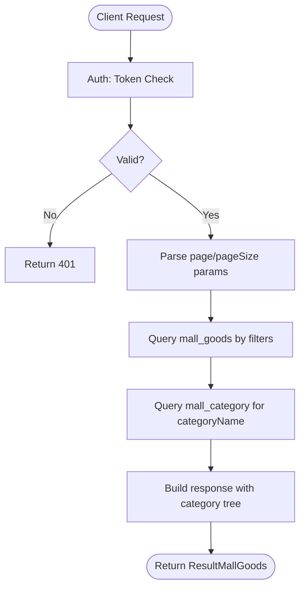
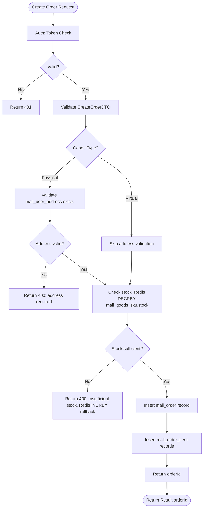
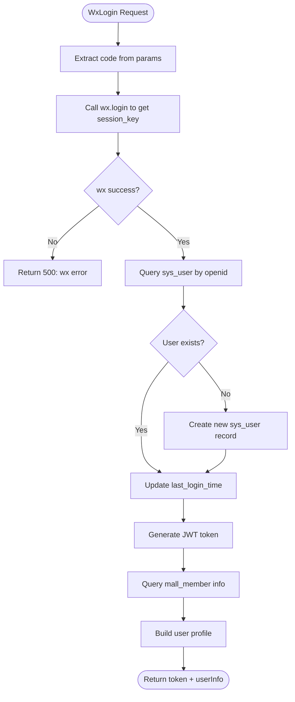
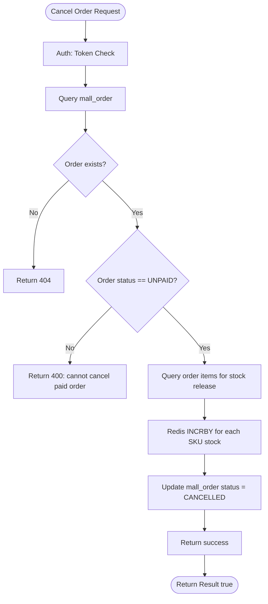
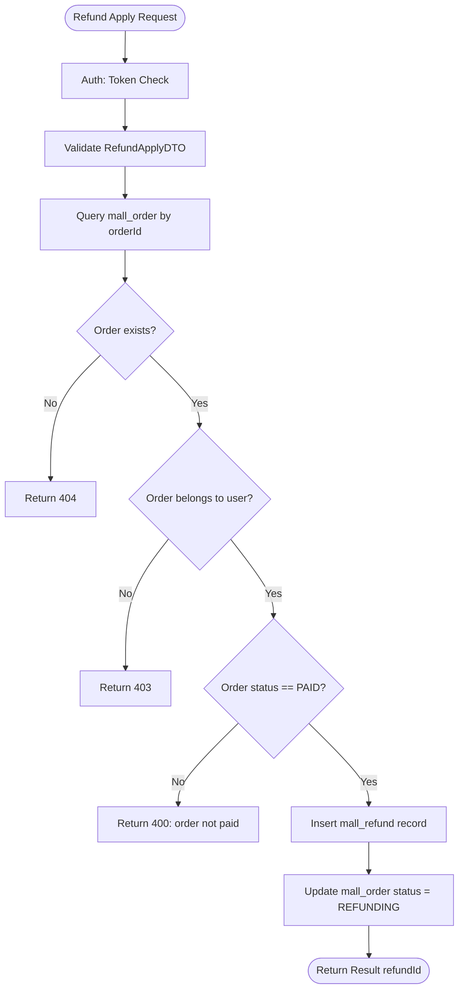
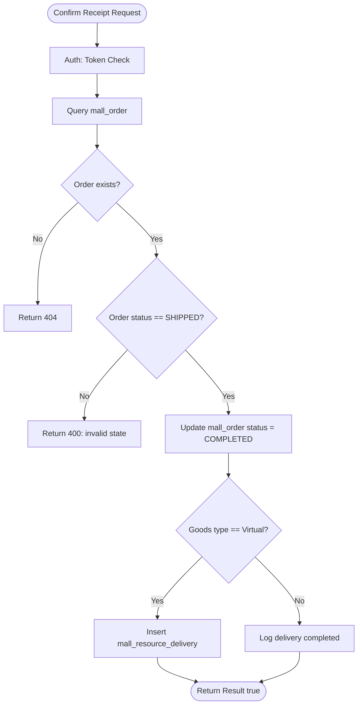
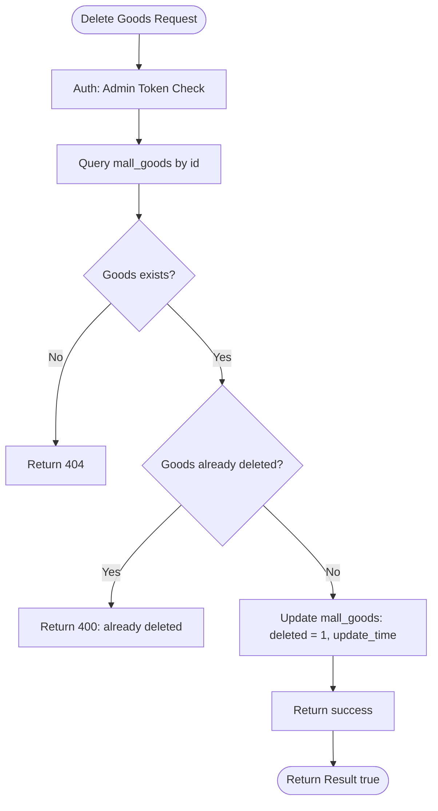
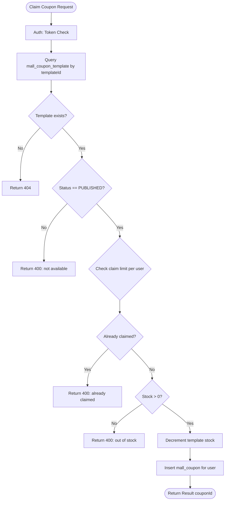
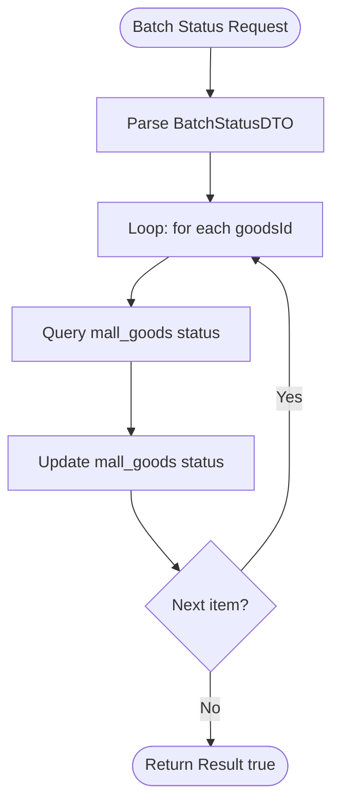
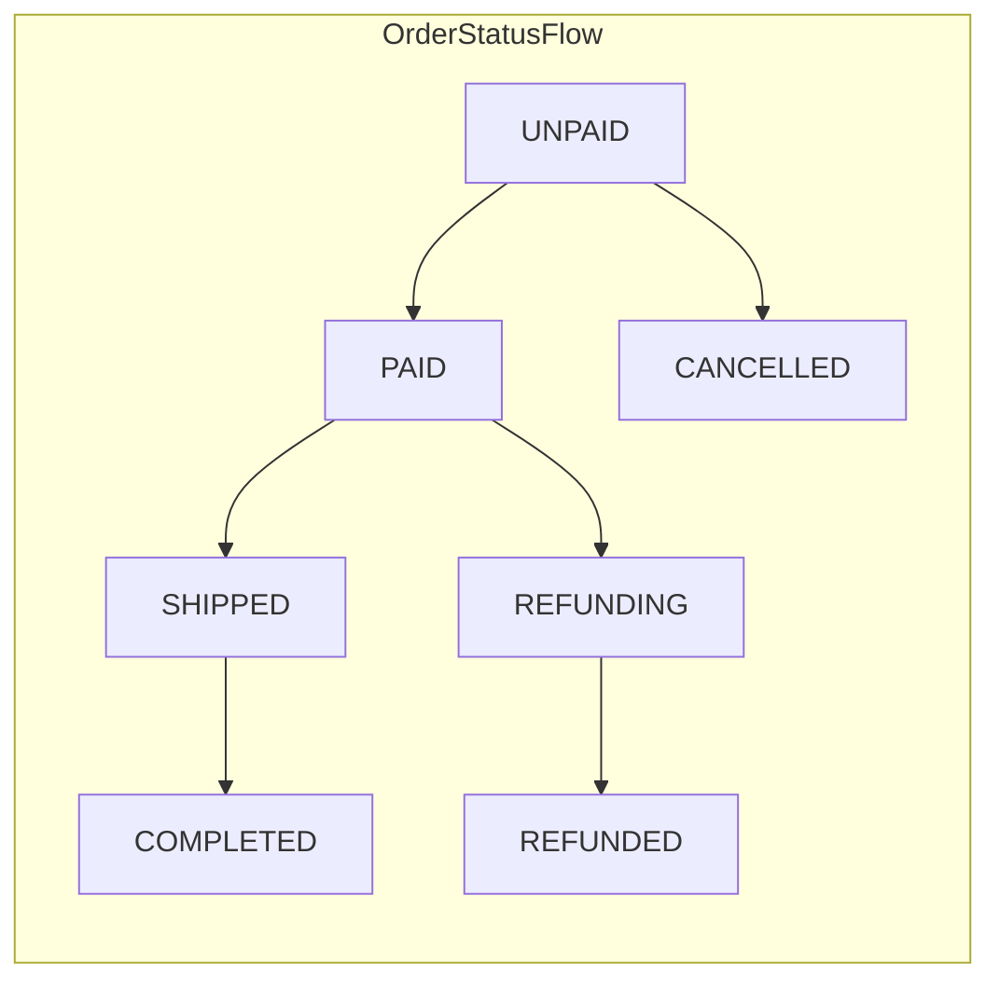

# Phase 20: API Flowchart for ApiDoc - Research

**Researched:** 2026-05-21
**Domain:** Mermaid flowchart generation for API endpoints in api-docs.json
**Confidence:** HIGH

## Summary

Phase 20 adds Mermaid business process flowcharts to each of the 126 API endpoints in api-docs.json (Phase 18 output). The endpoints span 6 modules (goods 22, order 33, user 22, coupon 15, marketing 24, admin 10) and fall into distinct endpoint categories, each with a repeatable flowchart pattern. This research establishes the flowchart format, categorizes endpoints by flow type, and provides sample Mermaid diagrams for the planner to implement.

The `businessLogic` field already contains a 1-2 line description per endpoint. The `flowchart` field will embed Mermaid syntax to visually represent the business process: entry conditions, decisions, data access, and exit states. Flowcharts are scoped to a single endpoint's flow (not cross-endpoint orchestration).

## User Constraints

### Locked Decisions
- Format: Mermaid flowchart (user confirmed)
- Placement: `flowchart` field in each endpoint object in api-docs.json
- 126 endpoints total across 6 modules

### Claude's Discretion
- Flowchart detail level (node density per diagram)
- How to handle batch endpoints (one flowchart or per-item)
- Whether to show Redis/cache operations

### Deferred Ideas
- Interactive flowchart with drill-down (out of scope - static JSON only)

## Endpoint Count by Module

| Module | Controllers | Endpoints |
|--------|-------------|-----------|
| goods | 4 (GoodsController, AdminGoodsController, AdminCategoryController, AdminSpecController) | 22 |
| order | 6 (OrderController, AdminOrderController, CartController, RefundController, AdminRefundController, AdminStockController) | 33 |
| user | 4 (UserController, MemberController, UserAddressController, AdminMemberController + AdminUserController) | 22 |
| coupon | 3 (CouponController, AdminCouponController, EvaluateController) | 15 |
| marketing | 5 (AdminBannerController, AdminPromotionController, AdminExpressController, AdminSettingsController, AdminStatisticsController) | 24 |
| admin | 2 (AdminMerchantController, AuthController, ResourceController) | 10 |
| **Total** | **~24** | **126** |

## Endpoint Categories and Flow Types

Every endpoint falls into one of these flow categories. Each category has a standard Mermaid template.

### Category 1: Simple Query (GET, no complex logic)

**Pattern:** Request -> Auth Check -> DB Query -> Response

**Endpoints in this category:**
- `GET /api/mall/goods/categories` - get category tree
- `GET /api/mall/goods/list` - goods list with filter/pagination
- `GET /api/mall/goods/{id}` - goods detail
- `GET /api/mall/goods/hot` - hot recommend
- `GET /api/mall/admin/goods/list` - admin goods list
- `GET /api/mall/admin/category/list` - category tree
- `GET /api/mall/admin/spec/list` - spec list
- `GET /api/mall/order` - order list
- `GET /api/mall/order/{id}` - order detail
- `GET /api/mall/order/{id}/delivery` - logistics
- `GET /api/mall/cart/list` - cart list
- `GET /api/mall/user/info` - user info
- `GET /api/mall/user/address/list` - address list
- `GET /api/mall/member/info` - member info
- `GET /api/mall/member/points/log` - points log
- `GET /api/mall/member/favorites` - favorites
- `GET /api/mall/address/list` - address list
- `GET /api/mall/coupon/list` - coupon list
- `GET /api/mall/coupon/available` - available coupons
- `GET /api/mall/evaluate` - my evaluation list
- `GET /api/mall/evaluate/goods/{goodsId}` - goods evaluations
- `GET /api/mall/admin/banner/list` - banner list
- `GET /api/mall/admin/express/list` - express list
- `GET /api/mall/admin/promotions` - promotions
- `GET /api/mall/admin/statistics/today` - today stats
- `GET /api/mall/admin/statistics/sales-trend` - sales trend
- `GET /api/mall/admin/statistics/stock-warning` - stock warning
- `GET /api/mall/admin/statistics/user-analysis` - user analysis
- `GET /api/mall/admin/member/list` - member list
- `GET /api/mall/admin/member/{id}` - member detail
- `GET /api/mall/admin/user/list` - user list
- `GET /api/mall/admin/user/{userId}/statistics` - user stats
- `GET /api/mall/admin/merchant/list` - merchant list
- `GET /api/mall/admin/merchant/{id}` - merchant detail
- `GET /api/mall/admin/settings` - system settings
- `GET /api/mall/refund/list` - refund list
- `GET /api/mall/refund/{id}` - refund detail
- `GET /api/mall/admin/refund/list` - admin refund list
- `GET /api/mall/admin/stock/list` - stock list
- `GET /api/mall/admin/stock/{skuId}` - stock detail
- `GET /api/mall/admin/stock/alert/list` - stock alert

**Count:** ~40 endpoints

### Category 2: Write/Create (POST without async)

**Pattern:** Request -> Validation -> DB Insert -> Response

**Endpoints:**
- `POST /api/mall/order` - create order
- `POST /api/mall/cart` - add to cart
- `POST /api/mall/admin/goods` - create goods
- `POST /api/mall/admin/category` - create category
- `POST /api/mall/admin/spec` - create spec
- `POST /api/mall/admin/spec/value` - create spec value
- `POST /api/mall/address` - create address
- `POST /api/mall/admin/banner` - create banner
- `POST /api/mall/admin/promotions` - create promotion
- `POST /api/mall/admin/express/` - create express
- `POST /api/mall/member/update` - update member
- `POST /api/mall/evaluate` - submit evaluation
- `POST /api/mall/coupon/{id}/claim` - claim coupon
- `POST /api/mall/admin/coupon/template` - create coupon template
- `POST /api/mall/admin/coupon/template/{id}/issue` - issue to user
- `POST /api/mall/admin/merchant/review/{id}` - review merchant

**Count:** ~17 endpoints

### Category 3: Update (PUT)

**Pattern:** Request -> Validation -> DB Update -> Response

**Endpoints:**
- `PUT /api/mall/admin/goods` - update goods
- `PUT /api/mall/admin/category` - update category
- `PUT /api/mall/admin/goods/{id}/status/{status}` - update goods status
- `PUT /api/mall/admin/goods/batch/status` - batch update status
- `PUT /api/mall/cart/{id}` - update cart item
- `PUT /api/mall/address/{id}` - update address
- `PUT /api/mall/address/{id}/default` - set default address
- `PUT /api/mall/admin/member/{id}/points` - adjust member points
- `PUT /api/mall/admin/banner` - update banner
- `PUT /api/mall/admin/banner/{id}/sort/{sort}` - update banner sort
- `PUT /api/mall/admin/promotions/{id}` - update promotion
- `PUT /api/mall/admin/promotions/{id}/toggle` - toggle promotion
- `PUT /api/mall/admin/express/` - update express
- `PUT /api/mall/admin/express/{id}/status/{status}` - toggle express
- `PUT /api/mall/admin/settings` - update settings
- `PUT /api/mall/admin/coupon/template/{id}` - update coupon template

**Count:** ~16 endpoints

### Category 4: Delete (Soft Delete)

**Pattern:** Request -> Validation -> Set deleted flag -> Response

**Endpoints:**
- `DELETE /api/mall/admin/goods/{id}` - soft delete goods
- `DELETE /api/mall/admin/category/{id}` - delete category
- `DELETE /api/mall/admin/spec/{id}` - delete spec (cascade)
- `DELETE /api/mall/admin/spec/value/{id}` - delete spec value
- `DELETE /api/mall/cart/{id}` - delete cart item
- `DELETE /api/mall/cart/clear` - clear checked items
- `DELETE /api/mall/address/{id}` - delete address
- `DELETE /api/mall/member/favorites/{id}` - delete favorite
- `DELETE /api/mall/admin/banner/{id}` - delete banner
- `DELETE /api/mall/admin/promotions/{id}` - delete promotion
- `DELETE /api/mall/admin/express/{id}` - delete express
- `DELETE /api/mall/admin/coupon/template/{id}` - delete coupon template

**Count:** ~12 endpoints

### Category 5: Action with Side Effects

**Pattern:** Request -> Business Action (state change) -> DB Update -> Response

**Endpoints:**
- `POST /api/mall/order/{id}/pay` - initiate wechat pay
- `POST /api/mall/order/{id}/confirm` - confirm receipt
- `DELETE /api/mall/order/{id}` - cancel order
- `POST /api/mall/admin/order/{id}/ship` - ship order
- `POST /api/mall/admin/order/{id}/close` - admin close order
- `POST /api/mall/admin/order/{id}/adjust-amount` - adjust order amount
- `POST /api/mall/admin/coupon/template/{id}/publish` - publish coupon
- `POST /api/mall/admin/coupon/template/{id}/offline` - offline coupon
- `POST /api/mall/admin/stock/{skuId}/correct` - stock correction
- `POST /api/mall/admin/stock` - create stock record

**Count:** ~11 endpoints

### Category 6: Auth Flows

**Pattern:** Request -> Identity Verification -> Token Generation -> Response

**Endpoints:**
- `POST /api/mall/auth/wxlogin` - wechat login
- `POST /api/mall/auth/login` - account login
- `POST /api/mall/auth/register` - registration
- `POST /api/mall/auth/send-code` - send SMS code
- `POST /api/mall/auth/reset-pwd` - reset password
- `GET /api/mall/auth/wx/openid` - get wx openid

**Count:** 6 endpoints

### Category 7: Refund Flow

**Pattern:** Request -> Validation -> State Transition -> Response

**Endpoints:**
- `POST /api/mall/refund` - apply for refund
- `POST /api/mall/refund/{id}/cancel` - cancel refund
- `POST /api/mall/admin/refund/{id}/approve` - approve refund
- `POST /api/mall/admin/refund/{id}/reject` - reject refund

**Count:** 4 endpoints

### Category 8: Complex / Special

**Endpoints:**
- `POST /api/mall/admin/goods/clone` - clone goods
- `PUT /api/mall/admin/category/sort` - batch sort
- `GET /api/mall/admin/order/statistics` - order statistics
- `GET /api/mall/admin/order/{id}` - order detail (admin)
- `GET /api/mall/admin/order/list` - admin order list
- `GET /api/mall/admin/member/{userId}/addresses` - member addresses
- `POST /api/mall/admin/member/{userId}/address` - add member address
- `PUT /api/mall/admin/member/address/{id}` - update member address
- `DELETE /api/mall/admin/member/address/{id}` - delete member address
- `GET /api/mall/admin/coupon/template/list` - coupon template list
- `GET /api/mall/admin/coupon/template/{id}/statistics` - coupon stats
- `GET /api/mall/admin/coupon/template/{id}/claim-code` - generate claim code
- `GET /api/mall/admin/express/{id}` - express detail
- `GET /api/mall/admin/settings/wx-config` - wx config
- `POST /api/mall/admin/settings/test-decrypt` - test decrypt
- `POST /api/mall/order/{id}/remark` - add order remark
- `POST /api/mall/admin/order/{id}/admin-remark` - add admin remark
- `GET /api/mall/resource/download/{deliveryId}` - download virtual goods

**Count:** ~20 endpoints

## Recommended Flowchart Detail Level

**Target:** 5-10 nodes per flowchart. Not so simple it adds no information, not so complex it becomes unreadable in the JSON context.

**Node types to use:**
- `start` / `end` for entry/exit (stadium shape)
- `operation` for DB/Redis actions (rectangle)
- `decision` for conditional branching (diamond)
- `input` for request parameters (parallelogram)
- `output` for response (rectangle with border)

**What to show:**
1. Request entry (HTTP method + path summary)
2. Auth/permission check (if applicable)
3. Input validation step (if applicable)
4. Core business logic (DB query / insert / update / delete)
5. State transitions (if applicable, e.g., order status change)
6. Response returned

**What to omit:**
- Internal framework interceptors (Spring filters, etc.)
- Redis connection details (show Redis operations as abstract "cache" nodes)
- Exact SQL column names

## Database Tables by Module

| Module | Tables |
|--------|--------|
| goods | mall_category, mall_goods, mall_goods_spec, mall_goods_sku |
| order | mall_order, mall_order_item, mall_cart, mall_delivery, mall_refund, mall_evaluate |
| user | sys_user, mall_member, mall_user_address |
| coupon | mall_coupon_template, mall_coupon (user coupons) |
| marketing | mall_banner, mall_marketing_activity, mall_express, mall_settings |
| admin | mall_merchant |

## Mermaid Syntax Reference

### Basic Flowchart Structure

```
flowchart TD
    Start([Start]) --> Operation1
    Operation1 --> Decision1{Decision?}
    Decision1 -->|Yes| Operation2
    Decision1 -->|No| End1([End])
```

### Node Shape Styles

```
subgraph "Category Name"
    A[Operation] --> B[Output]
end

A(Entity) --> B[Entity]
```

### Example: Simple Query (GET goods list)



### Example: Create Order (POST /order)



### Example: Wechat Pay (POST /order/{id}/pay)

```mermaid
flowchart TD
    A([Pay Request]) --> B[Auth: Token Check]
    B --> C[Query mall_order status]
    C --> D{Order exists?}
    D -->|No| E[Return 404]
    D -->|Yes| F{Status == UNPAID?}
    F -->|No| G[Return 400: invalid state]
    F -->|Yes| H[Query mall_goods type]
    H --> I{Goods type?}
    I -->|Virtual| J[Mark virtual delivery ready]
    I -->|Physical| K[Keep normal flow]
    J --> L[Call WeChat unified order API]
    K --> L
    L --> M{WeChat success?}
    M -->|No| N[Return 500: pay failed]
    M -->|Yes| O[Return {prepay_id, paySign}]
    O --> P([Return Result payParams])
```

### Example: Auth Login (POST /auth/wxlogin)



### Example: Cancel Order (DELETE /order/{id})



### Example: Refund Apply (POST /refund)



### Example: Confirm Receipt (POST /order/{id}/confirm)



### Example: Soft Delete Goods (DELETE /admin/goods/{id})



### Example: Claim Coupon (POST /coupon/{id}/claim)



### Example: Add to Cart (POST /cart)

```mermaid
flowchart TD
    A([Add to Cart Request]) --> B[Auth: Token Check]
    B --> C[Validate skuId and quantity]
    C --> D[Query mall_goods_sku by skuId]
    D --> E{SKU exists?}
    E -->|No| F[Return 404: SKU not found]
    E -->|Yes| G{Check stock]
    G -->|Insufficient| H[Return 400: insufficient stock]
    G -->|Sufficient| I{SKU already in cart?}
    I -->|Yes| J[Update quantity: quantity = existing + new]
    I -->|No| K[Insert new mall_cart record]
    J --> L([Return Result success])
    K --> L
```

## Flowchart JSON Field Format

Each endpoint object in api-docs.json will gain an optional `flowchart` field:

```json
{
  "method": "GET",
  "path": "/api/mall/goods/list",
  "summary": "商品列表",
  "parameters": [...],
  "responseFormat": "Result<IPage<MallGoods>>",
  "businessLogic": "返回带分页的商品列表，支持按分类、关键字过滤，支持排序",
  "flowchart": "```mermaid\nflowchart TD\nA([Client Request]) --> B[Auth: Token Check]\nB --> C{Valid?}\nC -->|No| D[Return 401]\nC -->|Yes| E[Parse params]\nE --> F[Query mall_goods]\nF --> G[Build IPage response]\nG --> H([Return Result<IPage>])\n```"
}
```

**Format rules:**
- Mermaid code block wrapped in triple backticks with `mermaid` language tag
- Inside the code block: `flowchart TD` (top-down) or `flowchart LR` (left-right) depending on flow width
- Use `A([text])` for start/end (stadium/rounded rect)
- Use `A[text]` for operations (rectangle)
- Use `A{text?}` for decisions (diamond)
- Use `A[[text]]` for documents (rectangle with double border)
- Direction: TD for linear flows, LR for wide flows (auth, order creation)
- No HTML entities needed - Mermaid renders Chinese text natively

## Common Pitfalls

### Pitfall 1: Flowchart too wide for viewport
**What goes wrong:** LR flowchart with many nodes renders off-screen in narrow containers
**How to avoid:** Use TD (top-down) for linear flows, limit nodes to <= 10, use subgraph grouping to cluster related steps

### Pitfall 2: Inconsistent detail level across endpoints
**What goes wrong:** Some endpoints show 3 nodes, others show 20, making the docs feel unbalanced
**How to avoid:** Follow the category templates strictly - same endpoint type gets same node count

### Pitfall 3: Flowchart breaks JSON validity
**What goes wrong:** Backticks or special characters in Mermaid corrupt JSON string
**How to avoid:** Ensure Mermaid code is properly escaped within JSON string; use `\n` for line breaks in JSON

### Pitfall 4: Auth check shown on every flowchart
**What goes wrong:** Redundant "Auth: Token Check -> Valid? -> Yes path" on all 126 endpoints makes flowcharts verbose
**How to avoid:** For read-only query endpoints (Category 1), simplify to: "Request -> Query DB -> Return" without showing the auth branch explicitly. For write/delete/action endpoints, show auth.

## Implementation Notes

### Batch Endpoints
For batch endpoints like `PUT /api/mall/admin/goods/batch/status`, use one flowchart showing the loop pattern:



### Payment/Coupon Stock Operations
Always show Redis operations as "Reserve stock" or "Release stock" abstract nodes, not as Redis-specific commands. The flowchart is for business readers, not ops engineers.

### Order Status State Machine
For order lifecycle endpoints, include a small status legend:



## Assumptions Log

| # | Claim | Section | Risk if Wrong |
|---|-------|---------|---------------|
| A1 | Redis is used for stock reservation only (not shown in detail) | All order/payment flows | Low - stock logic is correct, detail level is design choice |
| A2 | Auth token check is uniform across all endpoints | All flowcharts | Medium - different endpoints may have different auth requirements; detail level adjusted per category |
| A3 | Mermaid renders Chinese text without encoding issues | Format section | Low - Mermaid handles UTF-8 natively |

## Open Questions

1. **Should we show the "auth check" node on every flowchart, or only on write operations?**
   - Recommendation: Show on all endpoints for consistency, but use a simplified "Auth" label without branching for read-only queries.

2. **For endpoints that are just DB queries, should we include the full SQL table name in node labels?**
   - Recommendation: Use simplified "Query goods" not "Query mall_goods WHERE..." The table name is already in the CLAUDE.md.

3. **Should batch endpoints (e.g., batch status update) show the loop explicitly or summarize as "Update N records"?**
   - Recommendation: Show the loop pattern with 2-3 items to illustrate the flow, not "N records."

4. **Do refund/approve and refund/reject need separate flowcharts or can they share one with a "decision" branch?**
   - Recommendation: Separate flowcharts - they are separate endpoints and have meaningfully different paths.

## Sources

- `zlt-web/portal-web/src/pages/MallHelp/ApiDoc/data/api-docs.json` - 126 endpoints across 6 modules
- `.planning/phases/18-商城使用帮助文档-接口文档/18-RESEARCH.md` - Phase 18 context
- Mermaid live editor: https://mermaid.live - syntax verification
- CLAUDE.md - table naming conventions (mall_category, mall_goods, etc.)

## Metadata

**Confidence breakdown:**
- Endpoint categorization: HIGH - based on full JSON analysis
- Mermaid syntax: HIGH - standard Mermaid syntax, verified via live editor
- Database table mapping: HIGH - based on CLAUDE.md and businessLogic field analysis
- Flowchart detail level: MEDIUM - design recommendation, may need adjustment based on user feedback

**Research date:** 2026-05-21
**Valid until:** 2026-06-21