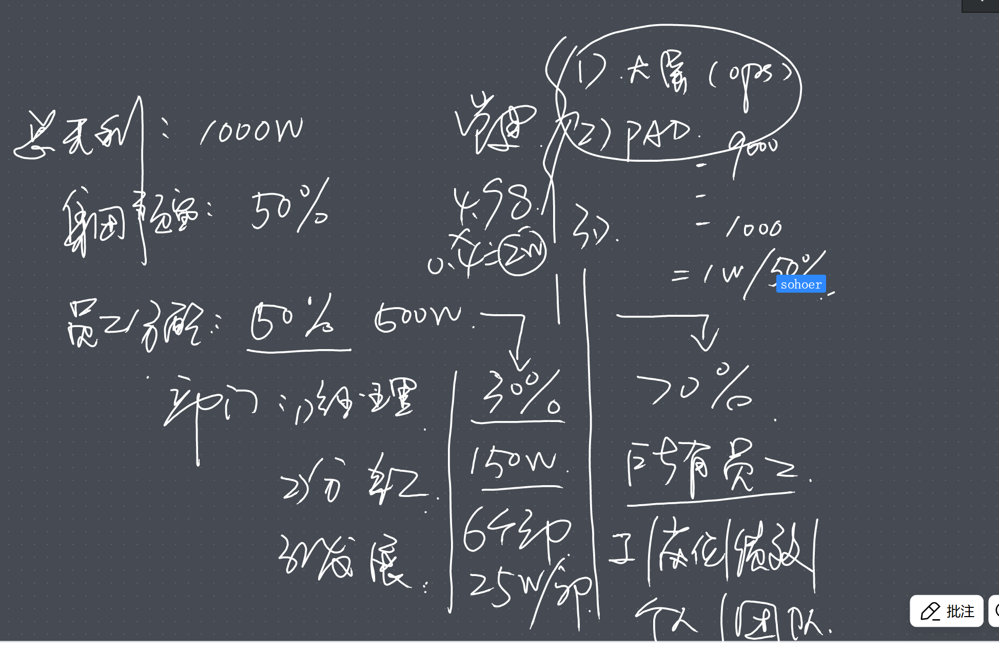
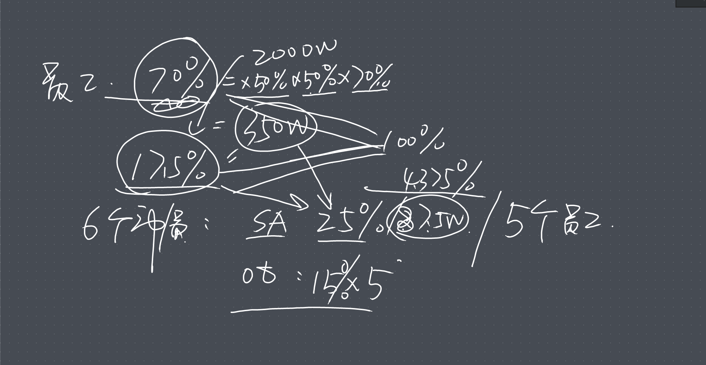
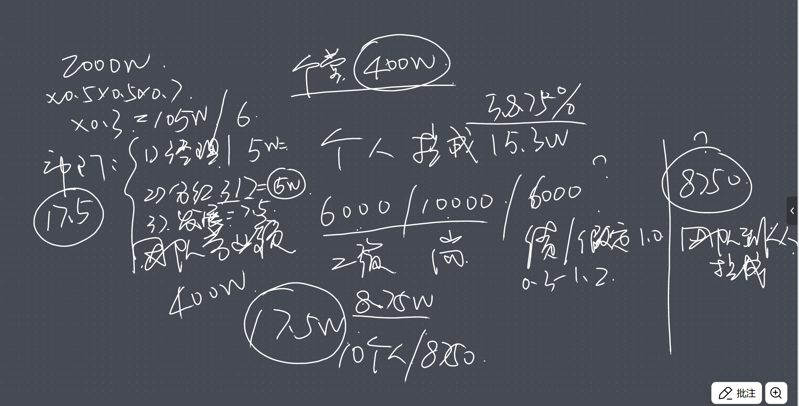

# 项目管理增加公式配置

## 定义全局财务模型字典

salary:工资
social_insurance:公司缴纳的社保公积金总额
fixed_operating_cost:固定运营成本
revenue:实际总营业额
total_revenue:总收入
gross_margin:毛利率
gross_profits:毛利润
total_gross_margin:总毛利率
variable_cost_rate:变动成本率
total_fixed_cost:总固定成本
net_profits:净利润
break_even_revenue:盈亏平衡点 (营业额)
tax_rate:税率
profit_before_tax:税前利润
profit_after_tax:税后利润
breakeven_point:盈亏平衡点
contribution_margin_ratio:边际贡献率

group_reserve_ratio:集团预留比例
project_reserve_ratio:团队预留比例
project_dept_reserve_ratio:团队中参与部门的计提比例
project_employee_reserve_ratio:团队中参与员工的计提比例
项目中参与员工的计提比例又划分2个部分
project_individual_commission_ratio:项目中个人提成比例
project_team_commission_ratio:项目中团队提成比例

项目ID 模型实例ID 

当月有4个项目
单个项目 a
单个项目 b
单个项目 c
单个项目 d
所有项目汇总 a b c d 汇总

从上到下计算分配比例
从下至上定义计算公式

问题
添加变量时，填写的必须，结果显示的还是可选

