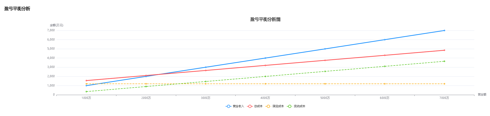

盈亏平衡分析图表
营业收入 = x
固定成本 = 常量值 = b
变动成本率 = a
变动成本 = 变动成本率*营业收入 = a*x
总成本 = 固定成本 + 变动成本率*营业收入 = a*x+b

fixed_cost = total_fixed_cost
total_revenue = revenue
total_variable_cost = variable_cost_rate *  revenue
总成本线 total_cost = total_fixed_cost + variable_cost_rate *  revenue

