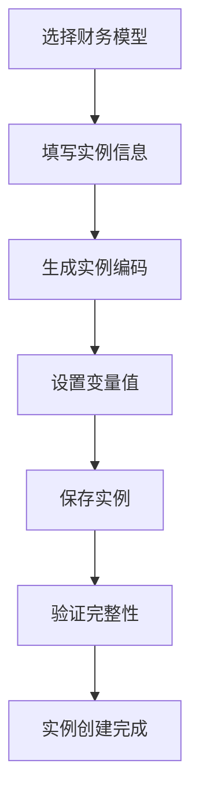
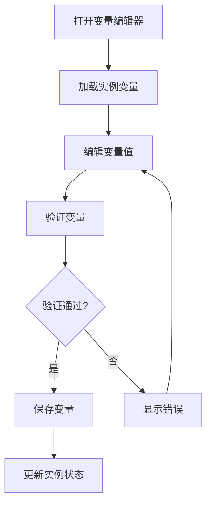
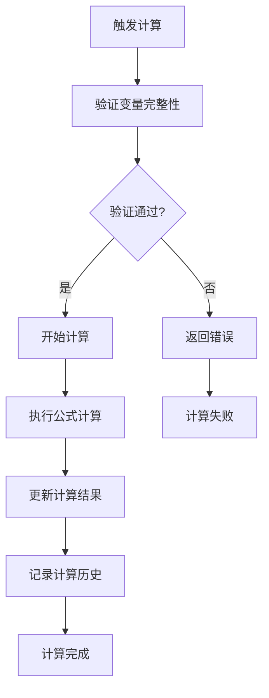

# 财务模型实例功能

## 功能概述

财务模型实例功能是财务模型系统的核心组件，用于存储和管理具体模型实例的变量数据。每个模型实例都基于一个财务模型模板，包含具体的变量值和计算结果，为项目管理提供数据约束和决策支持。

## 核心特性

### 1. 实例管理
- **实例创建**: 基于财务模型模板创建具体实例
- **实例配置**: 设置实例的基本信息和关联关系
- **实例状态**: 支持草稿、激活、停用、归档等状态管理
- **实例版本**: 支持实例版本控制和升级

### 2. 变量管理
- **变量值设置**: 为模型变量设置具体的数值
- **变量验证**: 验证变量值的有效性和完整性
- **变量计算**: 支持计算变量的自动计算
- **变量历史**: 记录变量值的变更历史

### 3. 计算引擎
- **自动计算**: 根据变量公式自动计算结果
- **手动计算**: 支持手动触发计算
- **计算历史**: 记录所有计算操作和结果
- **错误处理**: 完善的错误处理和提示机制

### 4. 项目管理集成
- **项目关联**: 实例可以关联到具体项目
- **数据约束**: 为项目分成设定提供数据约束
- **决策支持**: 基于计算结果提供决策建议

## 数据库设计

### 1. 模型实例表 (soo_financial_model_instance)

```sql
CREATE TABLE `soo_financial_model_instance` (
  `id` bigint(20) NOT NULL AUTO_INCREMENT COMMENT '主键ID',
  `instance_code` varchar(100) NOT NULL COMMENT '实例编码',
  `instance_name` varchar(200) NOT NULL COMMENT '实例名称',
  `model_id` bigint(20) NOT NULL COMMENT '关联的财务模型ID',
  `project_id` bigint(20) DEFAULT NULL COMMENT '关联的项目ID',
  `instance_status` varchar(20) NOT NULL DEFAULT 'DRAFT' COMMENT '实例状态',
  `instance_version` varchar(20) NOT NULL DEFAULT '1.0.0' COMMENT '实例版本号',
  `instance_description` text COMMENT '实例描述',
  `instance_config` longtext COMMENT '实例配置JSON',
  `calculation_result` longtext COMMENT '计算结果JSON',
  `last_calculated_at` datetime DEFAULT NULL COMMENT '最后计算时间',
  `calculation_status` varchar(20) DEFAULT 'PENDING' COMMENT '计算状态',
  `creator_id` bigint(20) NOT NULL COMMENT '创建人ID',
  `tenant_id` varchar(50) NOT NULL COMMENT '租户ID',
  `created_at` datetime NOT NULL DEFAULT CURRENT_TIMESTAMP COMMENT '创建时间',
  `updated_at` datetime NOT NULL DEFAULT CURRENT_TIMESTAMP ON UPDATE CURRENT_TIMESTAMP COMMENT '更新时间',
  `deleted` tinyint(1) NOT NULL DEFAULT '0' COMMENT '是否删除',
  PRIMARY KEY (`id`),
  UNIQUE KEY `uk_instance_code_tenant` (`instance_code`, `tenant_id`, `deleted`),
  KEY `idx_model_id` (`model_id`),
  KEY `idx_project_id` (`project_id`),
  KEY `idx_creator_id` (`creator_id`),
  KEY `idx_tenant_id` (`tenant_id`),
  KEY `idx_instance_status` (`instance_status`),
  KEY `idx_created_at` (`created_at`)
) ENGINE=InnoDB DEFAULT CHARSET=utf8mb4 COLLATE=utf8mb4_unicode_ci COMMENT='财务模型实例表';
```

### 2. 实例变量表 (soo_model_instance_variable)

```sql
CREATE TABLE `soo_model_instance_variable` (
  `id` bigint(20) NOT NULL AUTO_INCREMENT COMMENT '主键ID',
  `instance_id` bigint(20) NOT NULL COMMENT '模型实例ID',
  `variable_id` bigint(20) NOT NULL COMMENT '模型变量ID',
  `variable_value` text COMMENT '变量值',
  `calculated_value` text COMMENT '计算后的值',
  `is_calculated` tinyint(1) NOT NULL DEFAULT '0' COMMENT '是否已计算',
  `calculation_error` text COMMENT '计算错误信息',
  `created_at` datetime NOT NULL DEFAULT CURRENT_TIMESTAMP COMMENT '创建时间',
  `updated_at` datetime NOT NULL DEFAULT CURRENT_TIMESTAMP ON UPDATE CURRENT_TIMESTAMP COMMENT '更新时间',
  PRIMARY KEY (`id`),
  UNIQUE KEY `uk_instance_variable` (`instance_id`, `variable_id`),
  KEY `idx_instance_id` (`instance_id`),
  KEY `idx_variable_id` (`variable_id`)
) ENGINE=InnoDB DEFAULT CHARSET=utf8mb4 COLLATE=utf8mb4_unicode_ci COMMENT='模型实例变量值表';
```

### 3. 计算历史表 (soo_model_instance_calculation_history)

```sql
CREATE TABLE `soo_model_instance_calculation_history` (
  `id` bigint(20) NOT NULL AUTO_INCREMENT COMMENT '主键ID',
  `instance_id` bigint(20) NOT NULL COMMENT '模型实例ID',
  `calculation_version` varchar(20) NOT NULL COMMENT '计算版本号',
  `calculation_type` varchar(20) NOT NULL COMMENT '计算类型',
  `calculation_status` varchar(20) NOT NULL COMMENT '计算状态',
  `input_data` longtext COMMENT '输入数据JSON',
  `output_data` longtext COMMENT '输出数据JSON',
  `error_message` text COMMENT '错误信息',
  `execution_time` int(11) DEFAULT NULL COMMENT '执行时间(毫秒)',
  `triggered_by` bigint(20) NOT NULL COMMENT '触发人ID',
  `started_at` datetime NOT NULL COMMENT '开始时间',
  `completed_at` datetime DEFAULT NULL COMMENT '完成时间',
  `created_at` datetime NOT NULL DEFAULT CURRENT_TIMESTAMP COMMENT '创建时间',
  PRIMARY KEY (`id`),
  KEY `idx_instance_id` (`instance_id`),
  KEY `idx_calculation_version` (`calculation_version`),
  KEY `idx_calculation_status` (`calculation_status`),
  KEY `idx_started_at` (`started_at`)
) ENGINE=InnoDB DEFAULT CHARSET=utf8mb4 COLLATE=utf8mb4_unicode_ci COMMENT='模型实例计算历史表';
```

## 后端架构

### 1. 实体类设计

#### FinancialModelInstance
```java
@Data
@TableName("soo_financial_model_instance")
public class FinancialModelInstance {
    private Long id;
    private String instanceCode;
    private String instanceName;
    private Long modelId;
    private Long projectId;
    private String instanceStatus;
    private String instanceVersion;
    private String instanceDescription;
    private String instanceConfig;
    private String calculationResult;
    private LocalDateTime lastCalculatedAt;
    private String calculationStatus;
    private Long creatorId;
    private String tenantId;
    private LocalDateTime createdAt;
    private LocalDateTime updatedAt;
    private Integer deleted;
    
    // 关联信息
    private FinancialModel financialModel;
    private List<ModelInstanceVariable> instanceVariables;
    private Map<String, Object> configMap;
    private Map<String, Object> resultMap;
    private String creatorName;
    private String projectName;
}
```

#### ModelInstanceVariable
```java
@Data
@TableName("soo_model_instance_variable")
public class ModelInstanceVariable {
    private Long id;
    private Long instanceId;
    private Long variableId;
    private String variableValue;
    private String calculatedValue;
    private Integer isCalculated;
    private String calculationError;
    private LocalDateTime createdAt;
    private LocalDateTime updatedAt;
    
    // 关联信息
    private ModelVariable modelVariable;
    private String variableCode;
    private String variableName;
    private String variableType;
    private String dataType;
    private String unit;
    private Boolean isRequired;
    private Integer displayOrder;
}
```

### 2. 服务接口

#### FinancialModelInstanceService
```java
public interface FinancialModelInstanceService extends IService<FinancialModelInstance> {
    // 分页查询实例列表
    Page<FinancialModelInstance> pageInstances(Page<FinancialModelInstance> page, 
                                              Long modelId, Long projectId, 
                                              String instanceStatus, String keyword, String tenantId);
    
    // 创建实例
    FinancialModelInstance createInstance(FinancialModelInstance instance);
    
    // 更新实例
    FinancialModelInstance updateInstance(FinancialModelInstance instance);
    
    // 获取实例详情
    Map<String, Object> getInstanceDetail(Long instanceId);
    
    // 删除实例
    boolean deleteInstance(Long instanceId);
    
    // 启用/禁用实例
    boolean toggleInstanceStatus(Long instanceId, boolean isActive);
    
    // 克隆实例
    FinancialModelInstance cloneInstance(Long sourceInstanceId, String newInstanceCode, String newInstanceName);
    
    // 验证实例
    Map<String, Object> validateInstance(Long instanceId);
    
    // 执行计算
    Map<String, Object> executeCalculation(Long instanceId, String calculationType, Long triggeredBy);
    
    // 获取实例变量
    List<ModelInstanceVariable> getInstanceVariables(Long instanceId);
    
    // 更新实例变量
    boolean updateInstanceVariables(Long instanceId, List<ModelInstanceVariable> variables);
    
    // 导出实例配置
    String exportInstanceConfig(Long instanceId);
    
    // 导入实例配置
    FinancialModelInstance importInstanceConfig(String configJson, String tenantId);
}
```

### 3. 控制器设计

#### FinancialModelInstanceController
```java
@RestController
@RequestMapping("/api/soo/v2/model-instances")
public class FinancialModelInstanceController {
    
    @GetMapping
    public ApiResponse<Page<FinancialModelInstance>> getInstances(
            @RequestParam(defaultValue = "1") Integer page,
            @RequestParam(defaultValue = "10") Integer size,
            @RequestParam(required = false) Long modelId,
            @RequestParam(required = false) Long projectId,
            @RequestParam(required = false) String instanceStatus,
            @RequestParam(required = false) String keyword) {
        // 实现分页查询
    }
    
    @PostMapping
    public ApiResponse<FinancialModelInstance> createInstance(@RequestBody FinancialModelInstance instance) {
        // 实现创建实例
    }
    
    @GetMapping("/{id}")
    public ApiResponse<Map<String, Object>> getInstanceDetail(@PathVariable Long id) {
        // 实现获取详情
    }
    
    @PutMapping("/{id}")
    public ApiResponse<FinancialModelInstance> updateInstance(@PathVariable Long id, 
                                                             @RequestBody FinancialModelInstance instance) {
        // 实现更新实例
    }
    
    @DeleteMapping("/{id}")
    public ApiResponse<Boolean> deleteInstance(@PathVariable Long id) {
        // 实现删除实例
    }
    
    @PostMapping("/{id}/calculate")
    public ApiResponse<Map<String, Object>> executeCalculation(@PathVariable Long id,
                                                              @RequestBody CalculationRequest request) {
        // 实现执行计算
    }
    
    @GetMapping("/{id}/variables")
    public ApiResponse<List<ModelInstanceVariable>> getInstanceVariables(@PathVariable Long id) {
        // 实现获取变量
    }
    
    @PutMapping("/{id}/variables")
    public ApiResponse<Boolean> updateInstanceVariables(@PathVariable Long id,
                                                       @RequestBody List<ModelInstanceVariable> variables) {
        // 实现更新变量
    }
    
    @PostMapping("/{id}/clone")
    public ApiResponse<FinancialModelInstance> cloneInstance(@PathVariable Long id,
                                                            @RequestBody CloneRequest request) {
        // 实现克隆实例
    }
    
    @GetMapping("/{id}/export")
    public void exportInstanceConfig(@PathVariable Long id, HttpServletResponse response) {
        // 实现导出配置
    }
    
    @PostMapping("/import")
    public ApiResponse<FinancialModelInstance> importInstanceConfig(@RequestBody ImportRequest request) {
        // 实现导入配置
    }
}
```

## 前端架构

### 1. API服务

#### financialModelInstance.ts
```typescript
export class FinancialModelInstanceAPI {
  // 分页查询实例列表
  static async getInstances(params: {
    page: number;
    size: number;
    modelId?: number;
    projectId?: number;
    instanceStatus?: string;
    keyword?: string;
  }): Promise<{ data: FinancialModelInstance[]; total: number }>
  
  // 获取实例详情
  static async getInstanceDetail(id: number): Promise<Map<string, any>>
  
  // 创建实例
  static async createInstance(data: InstanceFormData): Promise<FinancialModelInstance>
  
  // 更新实例
  static async updateInstance(id: number, data: Partial<InstanceFormData>): Promise<FinancialModelInstance>
  
  // 删除实例
  static async deleteInstance(id: number): Promise<boolean>
  
  // 执行计算
  static async executeCalculation(data: CalculationRequest): Promise<CalculationResult>
  
  // 获取实例变量
  static async getInstanceVariables(instanceId: number): Promise<ModelInstanceVariable[]>
  
  // 更新实例变量
  static async updateInstanceVariables(instanceId: number, variables: ModelInstanceVariable[]): Promise<boolean>
  
  // 导出配置
  static async exportInstanceConfig(id: number): Promise<void>
  
  // 导入配置
  static async importInstanceConfig(configJson: string): Promise<FinancialModelInstance>
}
```

### 2. 页面组件

#### ModelInstanceManagement.tsx
- **实例列表**: 分页显示所有实例
- **搜索筛选**: 支持按模型、项目、状态、关键词筛选
- **操作按钮**: 创建、编辑、删除、克隆、计算等操作
- **统计信息**: 显示实例统计数据和状态分布

#### InstanceForm.tsx
- **基本信息**: 实例编码、名称、描述等
- **模型选择**: 选择关联的财务模型
- **项目关联**: 关联到具体项目
- **变量预览**: 显示模型包含的变量信息

#### InstanceDetail.tsx
- **基本信息**: 显示实例的详细信息
- **计算状态**: 显示当前计算状态和结果
- **配置信息**: 显示实例配置JSON
- **操作历史**: 显示实例的操作时间线

#### VariableEditor.tsx
- **变量列表**: 表格形式显示所有变量
- **变量编辑**: 支持不同类型变量的编辑
- **变量验证**: 验证变量值的有效性
- **批量保存**: 支持批量保存变量值

#### CalculationHistory.tsx
- **计算历史**: 显示所有计算记录
- **计算详情**: 查看每次计算的详细信息
- **统计信息**: 显示计算统计和性能指标
- **结果导出**: 支持导出计算结果

### 3. 样式设计

#### ModelInstanceManagement.less
```less
.model-instance-management {
  // 统计卡片样式
  .ant-statistic {
    .ant-statistic-title {
      font-size: 14px;
      color: #666;
    }
    
    .ant-statistic-content {
      font-size: 24px;
      font-weight: bold;
    }
  }

  // 表格样式
  .instance-table {
    .ant-table-thead > tr > th {
      background-color: #fafafa;
      font-weight: 600;
    }

    .instance-code {
      color: #1890ff;
      cursor: pointer;
      
      &:hover {
        text-decoration: underline;
      }
    }
  }

  // 表单样式
  .instance-form {
    .model-info {
      background-color: #f0f9ff;
      border: 1px solid #bae7ff;
      border-radius: 6px;
      padding: 12px;
    }
  }

  // 响应式设计
  @media (max-width: 768px) {
    .ant-table {
      font-size: 11px;
    }
  }
}
```

## 业务流程

### 1. 实例创建流程



### 2. 变量编辑流程



### 3. 计算执行流程



## 使用场景

### 1. 项目管理
- **项目预算**: 基于模型实例设置项目预算参数
- **成本控制**: 通过变量约束控制项目成本
- **收益分析**: 计算项目收益和利润率
- **风险评估**: 基于计算结果评估项目风险

### 2. 财务分析
- **盈亏平衡**: 计算盈亏平衡点和安全边际
- **敏感性分析**: 分析关键变量对结果的影响
- **场景模拟**: 模拟不同业务场景下的财务表现
- **决策支持**: 为管理决策提供数据支持

### 3. 业务运营
- **定价策略**: 基于成本模型制定定价策略
- **资源配置**: 优化资源配置和成本结构
- **绩效评估**: 评估业务单元和项目的绩效
- **战略规划**: 支持长期战略规划和预算编制

## 技术特点

### 1. 高性能
- **缓存机制**: 使用Redis缓存计算结果
- **异步计算**: 支持异步计算处理
- **批量操作**: 支持批量变量更新
- **分页查询**: 高效的分页查询机制

### 2. 高可用
- **事务管理**: 完整的事务支持
- **错误处理**: 完善的错误处理机制
- **数据备份**: 自动数据备份和恢复
- **监控告警**: 实时监控和告警机制

### 3. 易扩展
- **插件架构**: 支持计算引擎插件扩展
- **API设计**: RESTful API设计
- **多租户**: 支持多租户隔离
- **国际化**: 支持多语言国际化

### 4. 安全性
- **权限控制**: 细粒度的权限控制
- **数据加密**: 敏感数据加密存储
- **审计日志**: 完整的操作审计日志
- **访问控制**: 基于角色的访问控制

## 部署说明

### 1. 环境要求
- **Java**: JDK 11+
- **数据库**: MySQL 8.0+
- **缓存**: Redis 6.0+
- **前端**: Node.js 16+

### 2. 配置说明
```yaml
# 应用配置
spring:
  datasource:
    url: jdbc:mysql://localhost:3306/soo_financial
    username: ${DB_USERNAME}
    password: ${DB_PASSWORD}
  
  redis:
    host: localhost
    port: 6379
    password: ${REDIS_PASSWORD}

# 业务配置
soo:
  instance:
    max-variables: 1000
    calculation-timeout: 30000
    cache-enabled: true
    async-calculation: true
```

### 3. 启动步骤
1. **数据库初始化**: 执行SQL脚本创建表结构
2. **配置环境**: 设置环境变量和配置文件
3. **启动服务**: 启动后端服务
4. **部署前端**: 部署前端应用
5. **功能测试**: 测试各项功能

## 总结

财务模型实例功能是一个完整的模型实例管理解决方案，提供了：

1. **完整的实例生命周期管理**
2. **灵活的变量配置和计算**
3. **丰富的计算历史和统计**
4. **与项目管理的深度集成**
5. **高性能和高可用的技术架构**

该功能为企业的财务分析和决策支持提供了强有力的工具，能够有效提升财务管理的效率和准确性。 