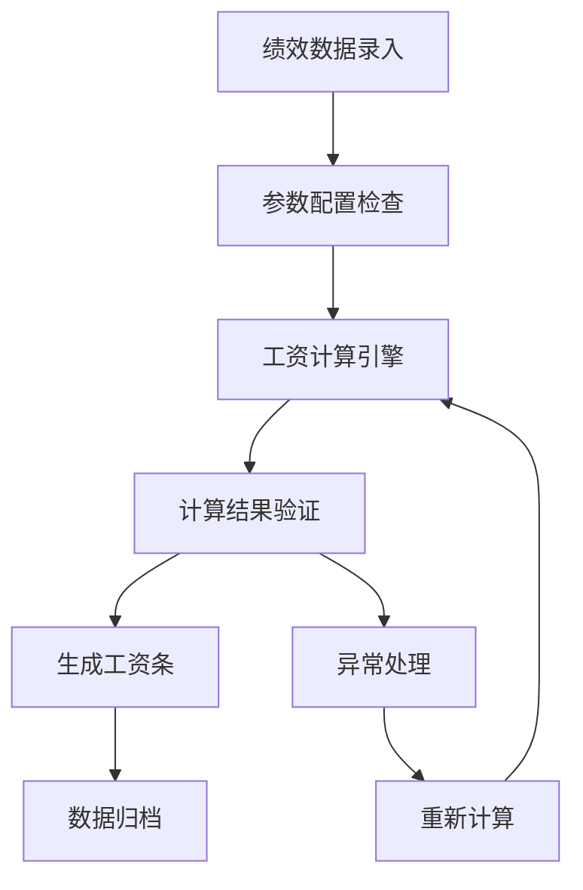
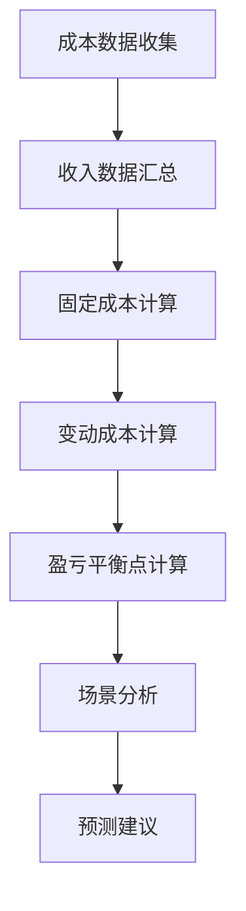

# 盈策通决策平台 - 原型设计文档

## 📋 1. 整体设计理念

### 1.1 设计原则
- **数据驱动**: 以数据可视化为核心，清晰呈现关键指标
- **简洁高效**: 简化操作流程，提升用户体验
- **智能预测**: 基于历史数据提供趋势分析和预测
- **移动优先**: 响应式设计，支持多端访问

### 1.2 视觉风格
- **色彩系统**: 
  - 主色调：#1890ff (蓝色，专业、信任)
  - 辅助色：#52c41a (绿色，增长、盈利)
  - 警告色：#faad14 (橙色，注意)
  - 错误色：#ff4d4f (红色，亏损、风险)
- **字体系统**: 
  - 中文：PingFang SC / Microsoft YaHei
  - 英文数字：Roboto / Arial
- **间距系统**: 8px基准网格系统

## 📱 2. 页面架构设计

### 2.1 导航结构

```
盈策通决策平台 (SalesOps Optimizer)
├── 🏠 运营工作台 (Dashboard)
│   ├── KPI指标概览
│   ├── 盈亏平衡趋势图
│   ├── 部门成本分布
│   └── 近期计算记录
│
├── ⚙️ 基础配置 (Config Center)
│   ├── 部门分红配置
│   ├── 职级薪资标准
│   ├── 员工薪酬配置
│   ├── 社保公积金基数
│   └── 地区工资系数
│
├── 📊 绩效管理 (Performance Management)
│   ├── 月度绩效录入
│   ├── KPI定义管理
│   ├── 绩效统计分析
│   └── 项目业绩管理
│
├── 💰 薪酬计算 (Payroll Calculate)
│   ├── 工资计算引擎
│   ├── 计算结果查询
│   ├── 工资条生成
│   └── 批量计算管理
│
├── 📈 财务分析 (Financial Analysis)
│   ├── 盈亏平衡分析
│   ├── 成本结构分析
│   ├── 业绩预测
│   └── 敏感性分析
│
└── 📑 报表中心 (Report Center)
    ├── 工资明细报表
    ├── 成本分析报表
    ├── 绩效汇总报表
    └── 综合分析报表
```

### 2.2 核心交互流程

#### 流程1: 薪酬计算流程


#### 流程2: 盈亏平衡分析流程


## 🎨 3. 关键页面原型设计

### 3.1 运营工作台 (Dashboard)

#### 布局结构
```
┌─────────────────────────────────────────────────────────────┐
│ 🏠 运营工作台                                    👤 管理员 │
├─────────────────────────────────────────────────────────────┤
│                                                             │
│ ┌─────────────┐ ┌─────────────┐ ┌─────────────┐ ┌─────────────┐ │
│ │本月薪酬总额  │ │盈亏平衡点    │ │在职员工数    │ │平均绩效得分  │ │
│ │¥2,385,600   │ │¥4,680,000   │ │156人         │ │87.3分        │ │
│ │📈 +8.2%     │ │📉 -3.5%     │ │👥 +5人      │ │⭐ +2.1      │ │
│ └─────────────┘ └─────────────┘ └─────────────┘ └─────────────┘ │
│                                                             │
│ ┌─────────────────────────────────┐ ┌─────────────────────┐ │
│ │        盈亏平衡趋势图             │ │    部门成本分布       │ │
│ │                                 │ │                     │ │
│ │ [营业额] [总成本] [盈亏平衡点]    │ │   [饼图显示各部门    │ │
│ │                                 │ │    薪酬分布比例]     │ │
│ │ 📊 趋势图表区域                  │ │                     │ │
│ └─────────────────────────────────┘ └─────────────────────┘ │
│                                                             │
│ ┌─────────────────────────────────────────────────────────┐ │
│ │              近期薪酬计算记录                              │ │
│ │ 月份    员工数  薪酬总额    平均薪酬   状态     计算时间     │ │
│ │ 2024-12  156   ¥2,385,600  ¥15,292  ✅已完成  12-25 09:30│ │
│ │ 2024-11  151   ¥2,201,450  ¥14,579  ✅已完成  11-25 10:15│ │
│ └─────────────────────────────────────────────────────────┘ │
└─────────────────────────────────────────────────────────────┘
```

#### 关键功能点
1. **实时KPI指标**: 4个核心指标卡片，支持趋势对比
2. **交互式图表**: 盈亏平衡趋势图支持时间筛选
3. **数据钻取**: 点击图表可查看详细数据
4. **快速操作**: 一键跳转到计算页面

### 3.2 基础配置中心 (Config Center)

#### 布局结构
```
┌─────────────────────────────────────────────────────────────┐
│ ⚙️ 基础配置                                     👤 管理员 │
├─────────────────────────────────────────────────────────────┤
│                                                             │
│ ┌─┬─┬─┬─┬─┐                                              │
│ │部│职│员│社│地│                                              │
│ │门│级│工│保│区│                                              │
│ │分│薪│薪│公│工│                                              │
│ │红│资│酬│积│资│                                              │
│ │配│标│配│金│系│                                              │
│ │置│准│置│基│数│                                              │
│ └─┴─┴─┴─┴─┘                                              │
│                                                             │
│ ┌─────────────────────────────────────────────────────────┐ │
│ │              部门分红配置                                 │ │
│ │                                                         │ │
│ │ 部门名称    分红权重(%)   生效日期     状态    操作        │ │
│ │ 销售部      30.0%        2024-01-01   🟢启用   编辑|删除   │ │
│ │ 产品研发部  25.0%        2024-01-01   🟢启用   编辑|删除   │ │
│ │ 市场运营部  20.0%        2024-01-01   🟢启用   编辑|删除   │ │
│ │                                                         │ │
│ │ [+ 新增配置] [💾 批量保存] [📤 导出] [📥 导入]           │ │
│ └─────────────────────────────────────────────────────────┘ │
└─────────────────────────────────────────────────────────────┘
```

#### 关键功能点
1. **Tab切换**: 5个配置模块快速切换
2. **批量操作**: 支持批量编辑、导入导出
3. **数据验证**: 实时校验配置合理性
4. **历史版本**: 配置变更历史追踪

### 3.3 绩效管理 (Performance Management)

#### 月度绩效录入页面
```
┌─────────────────────────────────────────────────────────────┐
│ 📊 绩效管理 > 月度绩效录入                        👤 管理员 │
├─────────────────────────────────────────────────────────────┤
│                                                             │
│ ┌─────────────────────────────────────────────────────────┐ │
│ │ 📅 月份选择: 2024-12  👥 部门筛选: 全部  🔍 员工搜索    │ │
│ └─────────────────────────────────────────────────────────┘ │
│                                                             │
│ ┌─────────────────────────────────────────────────────────┐ │
│ │              员工绩效录入表格                             │ │
│ │                                                         │ │
│ │ ☑️ 员工姓名  部门    绩效得分 个人项目营业额 团队项目营业额│ │
│ │ ☑️ 张三      销售部    95     ¥500,000      ¥1,000,000   │ │
│ │ ☑️ 李四      销售部    80     ¥200,000      ¥1,000,000   │ │
│ │ ☑️ 王五      研发部    90     ¥0           ¥500,000     │ │
│ │                                                         │ │
│ │ [全选] [反选] [💾 批量保存] [📊 数据分析] [📤 导出]      │ │
│ └─────────────────────────────────────────────────────────┘ │
│                                                             │
│ ┌─────────────────────────────────────────────────────────┐ │
│ │              绩效数据统计                                 │ │
│ │ 平均绩效得分: 87.3  📈 较上月提升2.1分                    │ │
│ │ 总营业额: ¥15,680,000  📈 较上月增长12.5%                │ │
│ └─────────────────────────────────────────────────────────┘ │
└─────────────────────────────────────────────────────────────┘
```

### 3.4 薪酬计算 (Payroll Calculate)

#### 工资计算页面
```
┌─────────────────────────────────────────────────────────────┐
│ 💰 薪酬计算 > 工资计算                            👤 管理员 │
├─────────────────────────────────────────────────────────────┤
│                                                             │
│ ┌─────────────────────────────────────────────────────────┐ │
│ │ 计算参数设置                                              │ │
│ │ 📅 计算月份: 2024-12  👥 员工范围: 全部员工               │ │
│ │ ⚙️ 计算模式: [标准计算] [测试计算] [重新计算]              │ │
│ │                                                         │ │
│ │ [🚀 开始计算] [📋 查看历史] [📊 预览结果]                 │ │
│ └─────────────────────────────────────────────────────────┘ │
│                                                             │
│ ┌─────────────────────────────────────────────────────────┐ │
│ │              计算进度                                     │ │
│ │ ████████████████████████████████ 100%                    │ │
│ │ 正在计算: 张三 (156/156)                                  │ │
│ │ 状态: ✅ 计算完成                                          │ │
│ └─────────────────────────────────────────────────────────┘ │
│                                                             │
│ ┌─────────────────────────────────────────────────────────┐ │
│ │              计算结果汇总                                 │ │
│ │                                                         │ │
│ │ 👥 员工总数: 156人     💰 薪酬总额: ¥2,385,600            │ │
│ │ 💵 平均薪酬: ¥15,292   🏦 社保公积金: ¥476,240           │ │
│ │ 💸 个税总额: ¥198,456  💳 实发总额: ¥1,710,904           │ │
│ │                                                         │ │
│ │ [📊 详细报表] [📄 生成工资条] [📤 导出数据]                │ │
│ └─────────────────────────────────────────────────────────┘ │
└─────────────────────────────────────────────────────────────┘
```

### 3.5 财务分析 (Financial Analysis)

#### 盈亏平衡分析页面
```
┌─────────────────────────────────────────────────────────────┐
│ 📈 财务分析 > 盈亏平衡分析                        👤 管理员 │
├─────────────────────────────────────────────────────────────┤
│                                                             │
│ ┌─────────────────────────────────────────────────────────┐ │
│ │ 分析参数设置                                              │ │
│ │ 📅 分析周期: 2024年12月  🎯 毛利率场景: [10%][30%][65%]   │ │
│ │ 💰 固定成本: ¥3,200,000  🔄 变动成本率: 15%              │ │
│ └─────────────────────────────────────────────────────────┘ │
│                                                             │
│ ┌─────────────────────────────────────────────────────────┐ │
│ │              盈亏平衡点分析图表                           │ │
│ │                                                         │ │
│ │     营业额                                               │ │
│ │     ↑                                                   │ │
│ │  8M │    ✨ 盈利区域                                     │ │
│ │     │   ╱                                               │ │
│ │  6M │  ╱ 📍盈亏平衡点                                    │ │
│ │     │ ╱   (¥4,680,000)                                  │ │
│ │  4M │╱                                                  │ │
│ │     │ 💔 亏损区域                                        │ │
│ │  2M │                                                   │ │
│ │     └─────────────────────────────→                     │ │
│ │     10%    30%    65%    毛利率                          │ │
│ └─────────────────────────────────────────────────────────┘ │
│                                                             │
│ ┌─────────────────────────────────────────────────────────┐ │
│ │              场景分析结果                                 │ │
│ │                                                         │ │
│ │ 毛利率场景    盈亏平衡点     目标营业额    达成概率        │ │
│ │ 10%          ¥10,666,667    ¥12,000,000   🔴 30%        │ │
│ │ 30%          ¥4,571,429     ¥6,000,000    🟡 65%        │ │
│ │ 65%          ¥2,461,538     ¥4,000,000    🟢 90%        │ │
│ │                                                         │ │
│ │ 💡 建议: 当前应重点提升毛利率至30%以上，确保稳定盈利      │ │
│ └─────────────────────────────────────────────────────────┘ │
└─────────────────────────────────────────────────────────────┘
```

## 🎯 4. 核心交互设计

### 4.1 数据录入优化
1. **智能填充**: 基于历史数据智能预填
2. **批量操作**: 支持Excel导入导出
3. **实时验证**: 数据格式实时校验
4. **自动保存**: 防止数据丢失

### 4.2 图表交互
1. **多维筛选**: 时间、部门、人员维度筛选
2. **数据钻取**: 点击图表查看明细数据
3. **趋势对比**: 支持同期对比分析
4. **导出分享**: 图表数据一键导出

### 4.3 移动端适配
1. **响应式布局**: 自适应不同屏幕尺寸
2. **手势操作**: 支持滑动、缩放操作
3. **简化界面**: 移动端突出核心功能
4. **离线模式**: 重要数据支持离线查看

## 🔧 5. 技术实现要点

### 5.1 前端技术栈
- **框架**: React 18 + TypeScript
- **UI组件**: Ant Design Pro 5.x
- **图表库**: Ant Design Charts + ECharts
- **状态管理**: Redux Toolkit + RTK Query
- **路由**: React Router v6

### 5.2 数据可视化
- **图表类型**: 
  - 折线图: 趋势分析
  - 柱状图: 对比分析  
  - 饼图: 占比分析
  - 仪表盘: 指标展示
- **交互效果**: 
  - 动画效果
  - 响应式图例
  - 数据标签
  - 缩放拖拽

### 5.3 性能优化
- **懒加载**: 图表组件按需加载
- **数据缓存**: Redux持久化缓存
- **分页加载**: 大数据量分页处理
- **防抖节流**: 搜索和输入优化

## 📱 6. 用户体验设计

### 6.1 操作流程优化
1. **新手引导**: 首次使用步骤指引
2. **快捷操作**: 常用功能一键访问
3. **操作反馈**: 清晰的成功/错误提示
4. **数据恢复**: 意外关闭数据不丢失

### 6.2 个性化配置
1. **仪表盘定制**: 用户可自定义KPI指标
2. **主题切换**: 支持明暗主题模式
3. **布局调整**: 可拖拽调整组件位置
4. **偏好设置**: 记住用户操作习惯

## 🚀 7. 创新功能设计

### 7.1 AI智能分析
1. **异常检测**: 自动识别数据异常
2. **趋势预测**: 基于机器学习的业绩预测
3. **智能建议**: 提供优化建议
4. **自然语言查询**: 支持语音查询数据

### 7.2 协作功能
1. **评论系统**: 数据节点支持评论讨论
2. **分享机制**: 报表一键分享
3. **权限控制**: 细粒度数据权限管理
4. **审批流程**: 关键操作需要审批

---

## 📊 原型图展示

基于以上设计，各页面原型将以现代化的Web界面呈现，具有以下特点：

1. **统一的视觉语言**: 遵循Portal 3.0设计规范
2. **清晰的信息层级**: 重要信息突出显示
3. **流畅的交互体验**: 操作简单直观
4. **完善的数据展示**: 多维度数据可视化
5. **智能的辅助功能**: AI驱动的决策支持

**设计文档版本**: v1.0  
**创建日期**: 2024-12-19  
**设计团队**: Portal 3.0 UX团队 