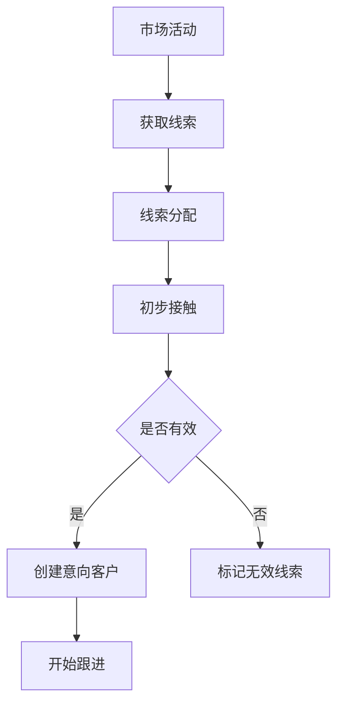
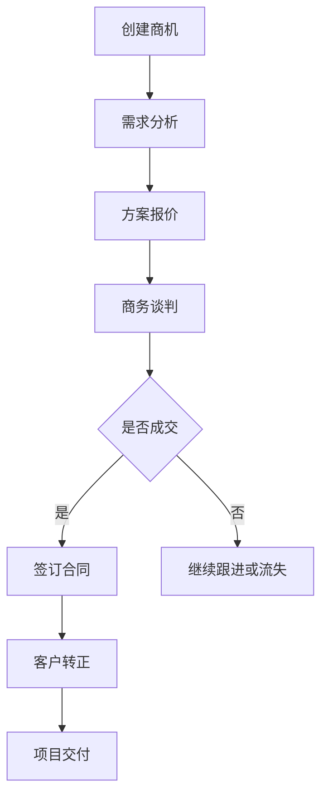
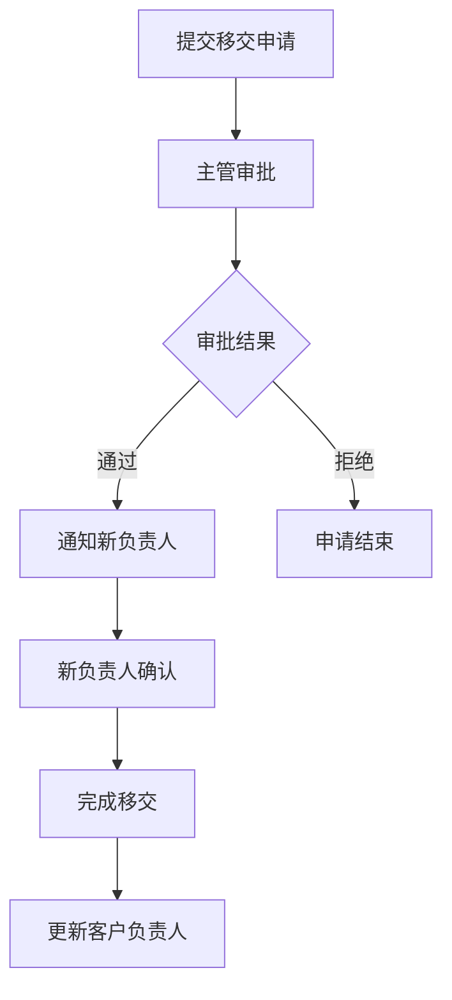
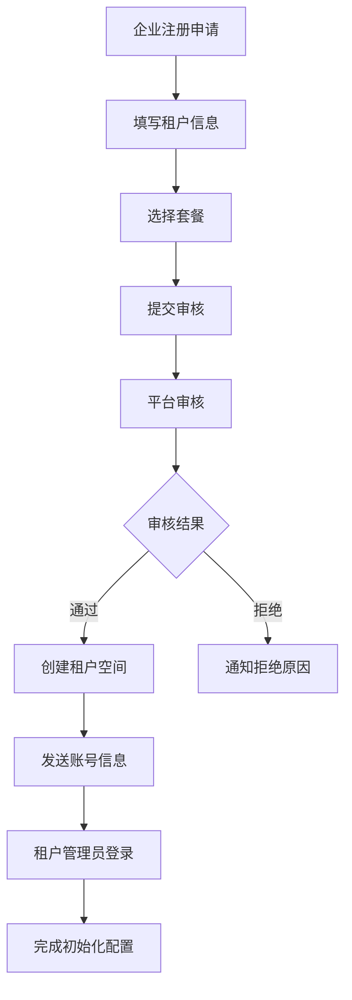

# CRM客户关系模块系统 - 产品需求文档

## 1. 产品概述

### 1.1 产品定位
打造一套现代化的SaaS多租户B2B/B2C客户关系管理系统，支持全客户生命周期管理，从商机获取到客户服务的完整业务闭环。采用多租户架构，为不同企业客户提供独立、安全、可定制的CRM服务。

### 1.2 核心价值
- **多租户SaaS架构**：完全隔离的多租户数据和功能，支持企业级安全和定制
- **客户数字化管理**：统一管理个人和企业客户信息
- **销售过程可视化**：完整的销售漏斗和商机管理
- **业务流程标准化**：规范化的客户跟进和移交流程
- **数据驱动决策**：丰富的报表分析和业务洞察
- **灵活配置**：支持租户级别的个性化配置和定制

### 1.3 目标用户
- **销售人员**：负责客户开发和维护
- **销售主管**：团队管理和业绩监控
- **客服人员**：客户服务和支持
- **管理层**：业务决策和数据分析

## 2. 功能需求

### 2.1 客户管理模块

#### 2.1.1 客户信息管理
- **个人客户**：姓名、身份证、手机、邮箱、微信、生日等
- **企业客户**：企业名称、营业执照、地址、联系人、规模等
- **客户标签**：支持自定义标签分类管理
- **客户分级**：A/B/C/D级客户分类管理
- **客户来源**：线上/线下/转介绍等来源渠道追踪

#### 2.1.2 客户状态管理
- **意向客户**：初步接触的潜在客户
- **正式客户**：已成交的付费客户
- **流失客户**：已流失的客户
- **状态转换**：支持状态流转和原因记录

#### 2.1.3 客户查重
- **身份证查重**：个人客户身份证唯一性检查
- **企业执照查重**：企业营业执照唯一性检查
- **手机号查重**：避免重复录入相同客户

### 2.2 商机管理模块

#### 2.2.1 销售漏斗
- **初步接触**：首次联系建立关系
- **需求分析**：了解客户具体需求
- **方案报价**：提供解决方案和报价
- **商务谈判**：价格和条款协商
- **合同签署**：签订正式合作协议
- **项目交付**：产品服务交付实施

#### 2.2.2 跟进记录
- **跟进方式**：电话、拜访、邮件、微信等
- **跟进内容**：详细记录沟通内容
- **下次跟进**：设置提醒时间
- **成交概率**：评估商机成功率
- **附件上传**：支持图片、文档等附件

#### 2.2.3 商机分析
- **转化漏斗**：各阶段转化率统计
- **周期分析**：平均销售周期分析
- **赢率统计**：成交概率趋势分析

### 2.3 客户移交模块

#### 2.3.1 移交申请
- **移交原因**：离职、调岗、工作量调整等
- **移交清单**：客户列表和详细信息
- **交接说明**：客户背景和注意事项
- **附件资料**：相关文档和资料

#### 2.3.2 审批流程
- **移交审批**：主管审批移交申请
- **接收确认**：新负责人确认接收
- **完成移交**：系统自动更新负责人

#### 2.3.3 移交记录
- **操作日志**：完整的移交操作记录
- **时间节点**：关键时间点追踪
- **参与人员**：移交相关人员记录

### 2.7 报表分析模块

#### 2.7.1 销售报表
- **业绩统计**：个人和团队业绩统计
- **漏斗分析**：销售漏斗各阶段分析
- **客户分析**：客户来源、分布、价值分析
- **趋势分析**：销售趋势和预测分析

#### 2.7.2 客户报表
- **客户概览**：客户总数、新增、流失统计
- **客户价值**：客户贡献度和价值分析
- **客户行为**：客户活跃度和参与度分析
- **满意度调查**：客户满意度统计分析


## 3. 非功能需求

### 3.1 性能要求
- **响应时间**：页面响应时间 < 2秒
- **并发支持**：支持1000用户同时在线
- **数据容量**：支持百万级客户数据

### 3.2 安全要求
- **数据加密**：敏感数据加密存储
- **访问控制**：基于角色的访问控制
- **操作审计**：关键操作日志记录
- **数据备份**：定期数据备份和恢复

### 3.3 可用性要求
- **系统可用性**：99.9%系统可用率
- **用户友好**：直观易用的操作界面
- **移动适配**：支持手机和平板访问

### 3.4 扩展性要求
- **模块化设计**：支持功能模块扩展
- **API接口**：提供标准REST API
- **第三方集成**：支持ERP、财务系统集成

### 3.5 多租户要求
- **数据隔离**：确保租户数据完全隔离，无数据泄露风险
- **性能隔离**：单租户异常不影响其他租户正常使用
- **资源管理**：支持租户级别的资源配额和使用限制
- **弹性扩展**：支持租户数量和用户数的弹性扩展
- **定制能力**：支持租户级别的功能定制和配置
- **计费精确**：准确计算各租户的资源使用和费用

## 5. 业务流程设计

### 5.1 客户获取流程


### 5.2 商机管理流程


### 5.3 客户移交流程


### 5.4 租户注册流程


## 6. 数据库设计优化

### 6.1 新增表结构

### 6.2 索引优化建议
- 客户表：customer_name, owner_employee_id, customer_status, customer_type
- 跟进表：customer_id, follow_time, employee_id, stage
- 移交表：customer_id, transfer_time, approval_status
- 合同表：customer_id, contract_status, sign_date
- 产品表：product_category_id, product_status, product_code

## 7. 技术架构

### 7.1 系统架构

### 1.3 现有技术架构分析

#### 1.3.1 后端框架 (microservices-platform)
**技术栈：**
- **框架版本**：Spring Boot 3.1.6 + Spring Cloud 2022.0.4
- **认证授权**：Spring Authorization Server 1.1.3
- **注册中心**：Nacos[8848]
- **API网关**：Spring Cloud Gateway[9900]
- **监控中心**：Spring Boot Admin[6500]

**现有服务模块：**
```
├── zlt-uaa -- 认证中心[8000]
├── zlt-gateway/sc-gateway -- API网关[9900]
├── zlt-register -- 注册中心Nacos[8848]
├── zlt-business -- 业务模块
│   ├── system-service 系统管理[7001] 包含租户管理
│   ├── organization-service 组织模块[7002] 包含部门管理 用户管理 岗位管理 员工管理
│   ├── organization-service 多维表格[7003] 包含部门管理 用户管理 岗位管理 员工管理
│   ├── project-manager-service 项目管理[7004] 
│   ├── crm-sevic 项目管理[7005] 
│   ├── file-center -- 文件中心[5000]
│   ├── code-generator -- 代码生成器[7300]
│   └── search-center -- 搜索中心[7100]
├── zlt-monitor
│   ├── sc-admin -- 应用监控[6500]
│   └── log-center -- 日志中心[7200]
└── zlt-commons -- 通用组件
    ├── zlt-auth-client-spring-boot-starter
    ├── zlt-common-spring-boot-starter
    ├── zlt-db-spring-boot-starter
    ├── zlt-redis-spring-boot-starter
    └── 其他通用starter
```

#### 1.3.2 前端框架 (portal-web)
**技术选型：**
- **主框架**：React + TypeScript
- **UI组件库**：Ant Design Pro
- **构建工具**：UmiJS v4.x
- **图表库**：Ant Design Charts
- **兼容版本**：保留LayUI版本作为备选

**项目结构：**
```
zlt-web/
├── react-web -- React主前端[8066]
│   └── src/main/frontend -- 前端源码(Ant Design Pro)
├── portal-web -- 新系统前段[8001]│ 
├── multi-table-web -- 新系统前段[8064]│    
└── layui-web -- LayUI备选前端[8066]
    └── src/main/resources/static -- 前端源码
```
## 8. API接口设计

### 8.1 客户管理接口
```
GET    /api/customers              - 获取客户列表
POST   /api/customers              - 创建客户
PUT    /api/customers/{id}         - 更新客户信息
DELETE /api/customers/{id}         - 删除客户
GET    /api/customers/{id}         - 获取客户详情
POST   /api/customers/check-duplicate - 客户查重检查
```

### 8.2 商机管理接口
```
GET    /api/opportunities          - 获取商机列表
POST   /api/opportunities          - 创建商机
PUT    /api/opportunities/{id}     - 更新商机
GET    /api/opportunities/funnel   - 获取销售漏斗数据
GET    /api/opportunities/statistics - 获取商机统计数据
```

### 8.3 跟进记录接口
```
GET    /api/follows                - 获取跟进记录
POST   /api/follows                - 创建跟进记录
GET    /api/follows/customer/{customerId} - 获取客户跟进记录
PUT    /api/follows/{id}           - 更新跟进记录
```

### 8.4 客户移交接口
```
POST   /api/transfers              - 创建移交申请
PUT    /api/transfers/{id}/approve - 审批移交申请
GET    /api/transfers              - 获取移交记录
POST   /api/transfers/{id}/confirm - 确认接收移交
```

### 8.5 报表分析接口
```
GET    /api/reports/customers      - 获取客户报表
GET    /api/reports/funnel         - 获取漏斗分析
```

## 9. 项目里程碑

### 9.1 第一阶段（3天）
**核心功能开发**
- ✅ 客户管理基础功能
- ✅ 商机管理核心功能
- ✅ 客户跟进记录
- ✅ 客户移交功能
- ✅ 移动端适配
- ✅ 基础报表功能

**交付成果**
- 客户CRUD功能完成
- 商机跟进流程建立
- 基础数据报表展示

### 9.2 第二阶段（2天）
**扩展功能开发**
- 🔄 客户移交功能
- 🔄 移动端适配


## 10. 风险评估与应对

### 10.1 技术风险
**风险点**：
- **性能风险**：大数据量查询性能优化
- **安全风险**：数据安全和隐私保护
- **集成风险**：第三方系统集成复杂度

**应对措施**：
- 数据库索引优化和分库分表
- 敏感数据加密和权限控制
- API接口标准化和充分测试

### 10.2 业务风险
**风险点**：
- **需求变更**：用户需求频繁变更
- **用户接受度**：新系统用户接受度
- **数据迁移**：旧系统数据迁移风险

**应对措施**：
- 敏捷开发和快速迭代
- 用户培训和原型验证
- 数据迁移方案测试

### 10.3 项目风险
**风险点**：
- **时间风险**：开发进度延期风险
- **资源风险**：人力资源不足风险
- **质量风险**：系统质量不达标风险

**应对措施**：
- 分阶段交付降低风险
- 技术预研和关键技术验证
- 持续集成和自动化测试

## 11. 成功标准

### 11.1 功能完整性
- ✅ 所有规划功能模块100%实现
- ✅ 核心业务流程正常运行
- ✅ 数据报表准确可靠

### 11.2 性能指标
- 📊 页面响应时间 < 2秒
- 📊 系统可用率 > 99.9%
- 📊 支持1000+并发用户
- 📊 数据查询响应 < 1秒

### 11.3 用户满意度
- 👥 用户界面友好度 > 85%
- 👥 功能易用性评分 > 85%
- 👥 系统稳定性评分 > 90%
- 👥 整体满意度 > 85%

### 11.4 业务价值
- 💼 客户管理效率提升30%
- 💼 销售过程透明度提升50%
- 💼 业务数据分析能力增强
- 💼 管理决策支持有效

---

**文档版本**：v1.0  
**创建日期**：2024年12月  
**最后更新**：2024年12月  
**负责人**：产品团队  
**审核人**：技术团队、业务团队