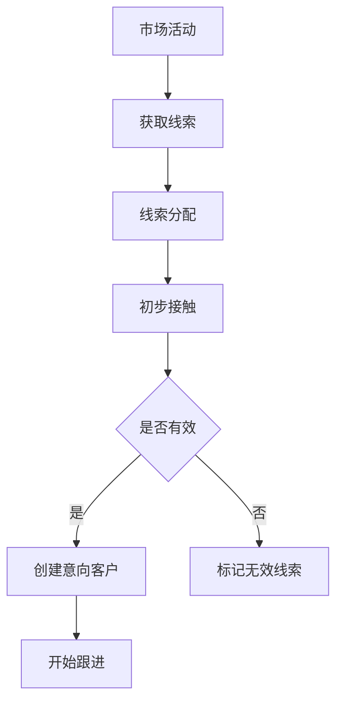
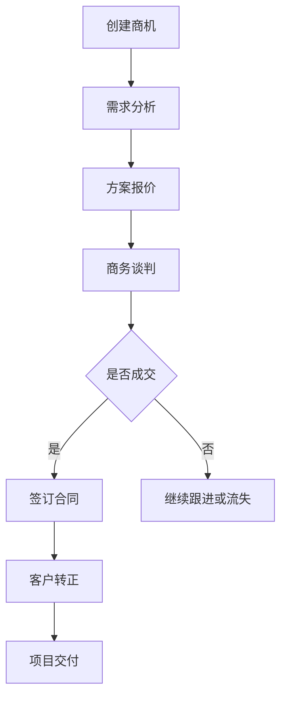
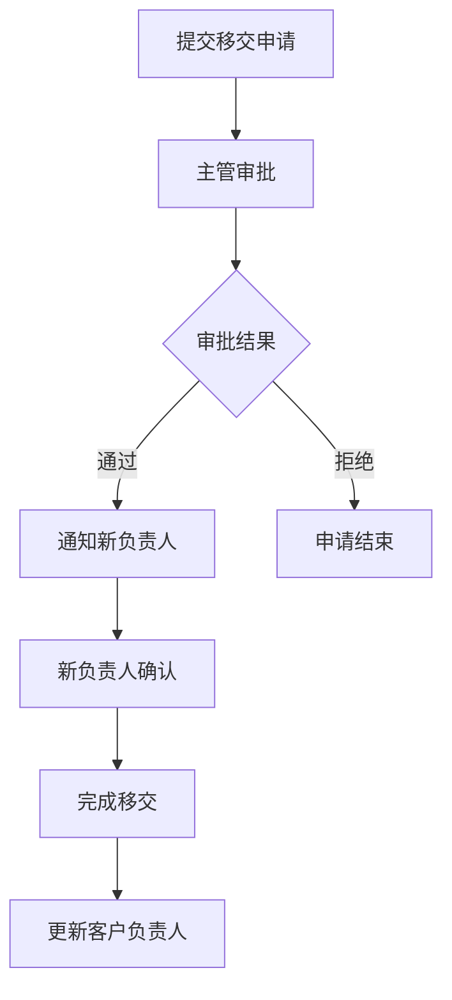
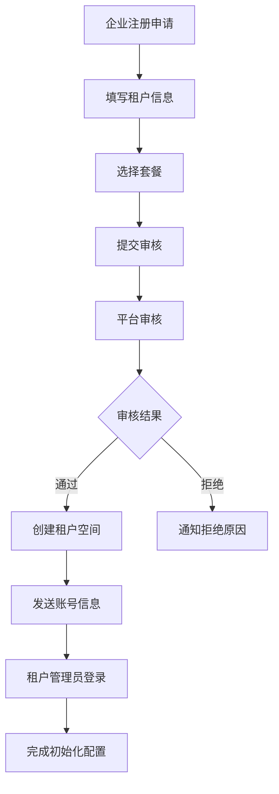

# CRM客户关系管理系统 - 产品需求文档

## 1. 产品概述

### 1.1 产品定位
打造一套现代化的SaaS多租户B2B/B2C客户关系管理系统，支持全客户生命周期管理，从商机获取到客户服务的完整业务闭环。采用多租户架构，为不同企业客户提供独立、安全、可定制的CRM服务。

### 1.2 核心价值
- **多租户SaaS架构**：完全隔离的多租户数据和功能，支持企业级安全和定制
- **客户数字化管理**：统一管理个人和企业客户信息
- **销售过程可视化**：完整的销售漏斗和商机管理
- **业务流程标准化**：规范化的客户跟进和移交流程
- **数据驱动决策**：丰富的报表分析和业务洞察
- **灵活配置**：支持租户级别的个性化配置和定制

### 1.3 目标用户
- **销售人员**：负责客户开发和维护
- **销售主管**：团队管理和业绩监控
- **客服人员**：客户服务和支持
- **管理层**：业务决策和数据分析

## 2. 功能需求

### 2.1 客户管理模块

#### 2.1.1 客户信息管理
- **个人客户**：姓名、身份证、手机、邮箱、微信、生日等
- **企业客户**：企业名称、营业执照、地址、联系人、规模等
- **客户标签**：支持自定义标签分类管理
- **客户分级**：A/B/C/D级客户分类管理
- **客户来源**：线上/线下/转介绍等来源渠道追踪

#### 2.1.2 客户状态管理
- **意向客户**：初步接触的潜在客户
- **正式客户**：已成交的付费客户
- **流失客户**：已流失的客户
- **状态转换**：支持状态流转和原因记录

#### 2.1.3 客户查重
- **身份证查重**：个人客户身份证唯一性检查
- **企业执照查重**：企业营业执照唯一性检查
- **手机号查重**：避免重复录入相同客户

### 2.2 商机管理模块

#### 2.2.1 销售漏斗
- **初步接触**：首次联系建立关系
- **需求分析**：了解客户具体需求
- **方案报价**：提供解决方案和报价
- **商务谈判**：价格和条款协商
- **合同签署**：签订正式合作协议
- **项目交付**：产品服务交付实施

#### 2.2.2 跟进记录
- **跟进方式**：电话、拜访、邮件、微信等
- **跟进内容**：详细记录沟通内容
- **下次跟进**：设置提醒时间
- **成交概率**：评估商机成功率
- **附件上传**：支持图片、文档等附件

#### 2.2.3 商机分析
- **转化漏斗**：各阶段转化率统计
- **周期分析**：平均销售周期分析
- **赢率统计**：成交概率趋势分析

### 2.3 客户移交模块

#### 2.3.1 移交申请
- **移交原因**：离职、调岗、工作量调整等
- **移交清单**：客户列表和详细信息
- **交接说明**：客户背景和注意事项
- **附件资料**：相关文档和资料

#### 2.3.2 审批流程
- **移交审批**：主管审批移交申请
- **接收确认**：新负责人确认接收
- **完成移交**：系统自动更新负责人

#### 2.3.3 移交记录
- **操作日志**：完整的移交操作记录
- **时间节点**：关键时间点追踪
- **参与人员**：移交相关人员记录

### 2.4 产品服务模块

#### 2.4.1 产品管理
- **产品分类**：多级分类管理
- **产品信息**：名称、型号、价格、描述
- **产品状态**：在售、停售、预售等
- **价格体系**：标准价、折扣价、会员价

#### 2.4.2 服务管理
- **服务类型**：咨询、实施、维护等
- **服务标准**：服务内容和标准定义
- **服务价格**：计费方式和价格体系

### 2.5 合同订单模块

#### 2.5.1 合同管理
- **合同信息**：合同编号、客户、金额、期限
- **合同条款**：付款方式、违约条款等
- **合同状态**：草拟、待签、已签、执行中、已完成
- **合同附件**：电子合同和相关文档

#### 2.5.2 订单管理
- **订单创建**：基于合同创建订单
- **订单跟踪**：订单状态和进度跟踪
- **发票管理**：开票申请和发票记录
- **收款记录**：收款状态和流水记录

### 2.6 权限管理模块

#### 2.6.1 角色权限
- **销售人员**：管理自己的客户和商机
- **销售主管**：管理团队客户和业绩
- **客服人员**：查看客户信息和服务记录
- **系统管理员**：系统配置和用户管理

#### 2.6.2 数据权限
- **个人数据**：只能查看自己负责的客户
- **部门数据**：可查看部门内所有客户
- **全部数据**：可查看所有客户数据
- **敏感信息**：身份证、银行账号等敏感信息权限控制

### 2.7 报表分析模块

#### 2.7.1 销售报表
- **业绩统计**：个人和团队业绩统计
- **漏斗分析**：销售漏斗各阶段分析
- **客户分析**：客户来源、分布、价值分析
- **趋势分析**：销售趋势和预测分析

#### 2.7.2 客户报表
- **客户概览**：客户总数、新增、流失统计
- **客户价值**：客户贡献度和价值分析
- **客户行为**：客户活跃度和参与度分析
- **满意度调查**：客户满意度统计分析

### 2.8 系统配置模块

#### 2.8.1 基础配置
- **客户分类**：客户类型和级别配置
- **商机阶段**：销售漏斗阶段配置
- **产品分类**：产品和服务分类配置
- **权限配置**：角色和权限配置

#### 2.8.2 业务配置
- **审批流程**：客户移交审批流程配置
- **提醒设置**：跟进提醒和到期提醒配置
- **字段配置**：自定义字段和表单配置

### 2.9 多租户管理模块

#### 2.9.1 租户管理
- **租户注册**：企业客户注册申请和审核
- **租户信息**：企业名称、联系人、联系方式、行业类型
- **租户状态**：试用、正式、暂停、过期等状态管理
- **套餐管理**：不同功能套餐和用户数限制
- **计费管理**：按用户数、功能模块、存储空间计费

#### 2.9.2 数据隔离
- **物理隔离**：每个租户独立数据库实例（可选）
- **逻辑隔离**：共享数据库，通过tenant_id区分数据
- **应用隔离**：租户级别的功能权限和界面定制
- **存储隔离**：文件和附件按租户分目录存储

#### 2.9.3 租户配置
- **功能配置**：启用/禁用特定功能模块
- **界面定制**：租户专属Logo、主题色、名称
- **业务配置**：租户级别的业务流程和规则
- **集成配置**：第三方系统集成参数设置

#### 2.9.4 用户管理
- **租户管理员**：租户内的超级管理员
- **用户邀请**：邀请用户加入租户
- **用户限制**：基于套餐的用户数量限制
- **跨租户访问**：系统管理员跨租户管理能力

#### 2.9.5 监控运营
- **使用统计**：租户用户活跃度、功能使用情况
- **资源监控**：存储空间、API调用量、并发数
- **性能分析**：租户维度的系统性能分析
- **告警通知**：资源超限、异常使用告警

## 3. 非功能需求

### 3.1 性能要求
- **响应时间**：页面响应时间 < 2秒
- **并发支持**：支持1000用户同时在线
- **数据容量**：支持百万级客户数据

### 3.2 安全要求
- **数据加密**：敏感数据加密存储
- **访问控制**：基于角色的访问控制
- **操作审计**：关键操作日志记录
- **数据备份**：定期数据备份和恢复

### 3.3 可用性要求
- **系统可用性**：99.9%系统可用率
- **用户友好**：直观易用的操作界面
- **移动适配**：支持手机和平板访问

### 3.4 扩展性要求
- **模块化设计**：支持功能模块扩展
- **API接口**：提供标准REST API
- **第三方集成**：支持ERP、财务系统集成

### 3.5 多租户要求
- **数据隔离**：确保租户数据完全隔离，无数据泄露风险
- **性能隔离**：单租户异常不影响其他租户正常使用
- **资源管理**：支持租户级别的资源配额和使用限制
- **弹性扩展**：支持租户数量和用户数的弹性扩展
- **定制能力**：支持租户级别的功能定制和配置
- **计费精确**：准确计算各租户的资源使用和费用

## 4. 用户角色与权限

### 4.1 销售人员
**权限范围**：
- 管理个人负责的客户和商机
- 创建和更新客户信息
- 记录客户跟进和商机进展
- 申请客户移交
- 查看个人业绩报表

### 4.2 销售主管
**权限范围**：
- 管理团队所有客户和商机
- 审批客户移交申请
- 分配客户和商机
- 查看团队业绩报表
- 设置销售目标和考核

### 4.3 客服人员
**权限范围**：
- 查看客户基本信息
- 记录客户服务记录
- 处理客户投诉和建议
- 查看客户满意度数据

### 4.4 租户管理员
**权限范围**：
- 租户内用户账号管理
- 租户角色权限配置
- 租户参数配置
- 租户数据管理
- 租户功能定制

### 4.5 系统管理员
**权限范围**：
- 全系统用户账号管理
- 租户管理和配置
- 系统参数配置
- 数据备份和恢复
- 系统监控和维护
- 跨租户管理能力

### 4.6 平台运营
**权限范围**：
- 租户注册审核
- 套餐管理和计费
- 运营数据分析
- 客户服务支持
- 平台监控告警

## 5. 业务流程设计

### 5.1 客户获取流程


### 5.2 商机管理流程


### 5.3 客户移交流程


### 5.4 租户注册流程


## 6. 数据库设计优化

### 6.1 新增表结构

#### 租户表 (tenant)
| 字段名 | 类型 | 空/非空 | 说明 |
|--------|------|---------|------|
| tenant_id | BIGINT | NOT NULL | 租户ID，主键 |
| tenant_code | VARCHAR(50) | NOT NULL | 租户代码，唯一 |
| tenant_name | VARCHAR(100) | NOT NULL | 租户名称 |
| tenant_type | ENUM('enterprise','trial','demo') | NOT NULL | 租户类型 |
| tenant_status | ENUM('active','inactive','suspended','expired') | NOT NULL | 租户状态 |
| industry_type | VARCHAR(50) | NULL | 行业类型 |
| contact_name | VARCHAR(50) | NOT NULL | 联系人姓名 |
| contact_phone | VARCHAR(20) | NOT NULL | 联系人电话 |
| contact_email | VARCHAR(100) | NOT NULL | 联系人邮箱 |
| admin_user_id | BIGINT | NULL | 租户管理员用户ID |
| package_id | INT | NOT NULL | 套餐ID |
| user_limit | INT | NOT NULL | 用户数限制 |
| storage_limit | BIGINT | NOT NULL | 存储空间限制(MB) |
| expire_time | DATETIME | NULL | 到期时间 |
| custom_domain | VARCHAR(100) | NULL | 自定义域名 |
| logo_url | VARCHAR(255) | NULL | Logo地址 |
| theme_color | VARCHAR(10) | NULL | 主题色 |
| created_at | DATETIME | NOT NULL | 创建时间 |
| updated_at | DATETIME | NULL | 更新时间 |
| is_deleted | TINYINT(1) | NOT NULL | 删除标记 |

#### 套餐表 (package)
| 字段名 | 类型 | 空/非空 | 说明 |
|--------|------|---------|------|
| package_id | INT | NOT NULL | 套餐ID，主键 |
| package_name | VARCHAR(50) | NOT NULL | 套餐名称 |
| package_type | ENUM('basic','standard','premium','enterprise') | NOT NULL | 套餐类型 |
| user_limit | INT | NOT NULL | 用户数限制 |
| storage_limit | BIGINT | NOT NULL | 存储限制(MB) |
| feature_config | JSON | NULL | 功能配置 |
| price_monthly | DECIMAL(10,2) | NOT NULL | 月费 |
| price_yearly | DECIMAL(10,2) | NOT NULL | 年费 |
| is_enabled | TINYINT(1) | NOT NULL | 是否启用 |
| created_at | DATETIME | NOT NULL | 创建时间 |

#### 租户配置表 (tenant_config)
| 字段名 | 类型 | 空/非空 | 说明 |
|--------|------|---------|------|
| config_id | BIGINT | NOT NULL | 配置ID，主键 |
| tenant_id | BIGINT | NOT NULL | 租户ID |
| config_key | VARCHAR(100) | NOT NULL | 配置键 |
| config_value | TEXT | NULL | 配置值 |
| config_type | VARCHAR(50) | NOT NULL | 配置类型 |
| created_at | DATETIME | NOT NULL | 创建时间 |
| updated_at | DATETIME | NULL | 更新时间 |

#### 租户使用统计表 (tenant_usage)
| 字段名 | 类型 | 空/非空 | 说明 |
|--------|------|---------|------|
| usage_id | BIGINT | NOT NULL | 统计ID，主键 |
| tenant_id | BIGINT | NOT NULL | 租户ID |
| stat_date | DATE | NOT NULL | 统计日期 |
| user_count | INT | NOT NULL | 用户数 |
| active_user_count | INT | NOT NULL | 活跃用户数 |
| storage_used | BIGINT | NOT NULL | 已用存储(MB) |
| api_calls | BIGINT | NOT NULL | API调用次数 |
| login_count | INT | NOT NULL | 登录次数 |
| created_at | DATETIME | NOT NULL | 创建时间 |

#### 产品表 (product)
| 字段名 | 类型 | 空/非空 | 说明 |
|--------|------|---------|------|
| product_id | BIGINT | NOT NULL | 产品ID，主键 |
| tenant_id | BIGINT | NOT NULL | 租户ID |
| product_name | VARCHAR(100) | NOT NULL | 产品名称 |
| product_category_id | INT | NULL | 产品分类ID |
| product_code | VARCHAR(50) | NOT NULL | 产品编码，租户内唯一 |
| standard_price | DECIMAL(10,2) | NOT NULL | 标准价格 |
| product_status | ENUM('在售','停售','预售') | NOT NULL | 产品状态 |
| description | TEXT | NULL | 产品描述 |
| created_at | DATETIME | NOT NULL | 创建时间 |
| created_by | INT | NOT NULL | 创建人ID |
| updated_at | DATETIME | NULL | 更新时间 |
| updated_by | INT | NULL | 更新人ID |
| is_deleted | TINYINT(1) | NOT NULL | 删除标记(0:正常 1:删除) |

#### 合同表 (contract)
| 字段名 | 类型 | 空/非空 | 说明 |
|--------|------|---------|------|
| contract_id | BIGINT | NOT NULL | 合同ID，主键 |
| tenant_id | BIGINT | NOT NULL | 租户ID |
| contract_no | VARCHAR(50) | NOT NULL | 合同编号，租户内唯一 |
| customer_id | BIGINT | NOT NULL | 客户ID，外键 |
| contract_amount | DECIMAL(12,2) | NOT NULL | 合同金额 |
| contract_status | ENUM('草拟','待签','已签','执行中','已完成') | NOT NULL | 合同状态 |
| sign_date | DATE | NULL | 签署日期 |
| start_date | DATE | NOT NULL | 开始日期 |
| end_date | DATE | NOT NULL | 结束日期 |
| contract_content | TEXT | NULL | 合同内容 |
| created_at | DATETIME | NOT NULL | 创建时间 |
| created_by | INT | NOT NULL | 创建人ID |
| updated_at | DATETIME | NULL | 更新时间 |
| updated_by | INT | NULL | 更新人ID |
| is_deleted | TINYINT(1) | NOT NULL | 删除标记 |

#### 权限表 (permission)
| 字段名 | 类型 | 空/非空 | 说明 |
|--------|------|---------|------|
| permission_id | INT | NOT NULL | 权限ID，主键 |
| permission_name | VARCHAR(50) | NOT NULL | 权限名称 |
| permission_code | VARCHAR(50) | NOT NULL | 权限代码，唯一 |
| resource_type | ENUM('menu','button','data') | NOT NULL | 资源类型 |
| resource_url | VARCHAR(200) | NULL | 资源路径 |
| parent_id | INT | NULL | 父权限ID |
| sort_order | INT | NOT NULL | 排序 |
| is_enabled | TINYINT(1) | NOT NULL | 是否启用 |

#### 角色权限关系表 (role_permission)
| 字段名 | 类型 | 空/非空 | 说明 |
|--------|------|---------|------|
| id | BIGINT | NOT NULL | 主键ID |
| role_id | INT | NOT NULL | 角色ID |
| permission_id | INT | NOT NULL | 权限ID |
| created_at | DATETIME | NOT NULL | 创建时间 |

#### 客户标签表 (customer_tag)
| 字段名 | 类型 | 空/非空 | 说明 |
|--------|------|---------|------|
| tag_id | INT | NOT NULL | 标签ID，主键 |
| tag_name | VARCHAR(50) | NOT NULL | 标签名称 |
| tag_color | VARCHAR(10) | NULL | 标签颜色 |
| tag_category | VARCHAR(50) | NULL | 标签分类 |
| created_at | DATETIME | NOT NULL | 创建时间 |
| created_by | INT | NOT NULL | 创建人ID |
| is_deleted | TINYINT(1) | NOT NULL | 删除标记 |

#### 客户标签关系表 (customer_tag_relation)
| 字段名 | 类型 | 空/非空 | 说明 |
|--------|------|---------|------|
| id | BIGINT | NOT NULL | 主键ID |
| customer_id | BIGINT | NOT NULL | 客户ID |
| tag_id | INT | NOT NULL | 标签ID |
| created_at | DATETIME | NOT NULL | 创建时间 |
| created_by | INT | NOT NULL | 创建人ID |

#### 商机表 (opportunity)
| 字段名 | 类型 | 空/非空 | 说明 |
|--------|------|---------|------|
| opportunity_id | BIGINT | NOT NULL | 商机ID，主键 |
| tenant_id | BIGINT | NOT NULL | 租户ID |
| customer_id | BIGINT | NOT NULL | 客户ID |
| opportunity_name | VARCHAR(100) | NOT NULL | 商机名称 |
| opportunity_source | VARCHAR(50) | NULL | 商机来源 |
| stage | ENUM('初步接触','需求分析','方案报价','商务谈判','合同签署','成交','流失') | NOT NULL | 商机阶段 |
| probability | TINYINT | NULL | 成交概率(0-100%) |
| expected_amount | DECIMAL(12,2) | NULL | 预期金额 |
| expected_close_date | DATE | NULL | 预期成交日期 |
| owner_employee_id | INT | NOT NULL | 负责人ID |
| competitor | VARCHAR(200) | NULL | 竞争对手 |
| description | TEXT | NULL | 商机描述 |
| created_at | DATETIME | NOT NULL | 创建时间 |
| created_by | INT | NOT NULL | 创建人ID |
| updated_at | DATETIME | NULL | 更新时间 |
| updated_by | INT | NULL | 更新人ID |
| is_deleted | TINYINT(1) | NOT NULL | 删除标记 |

#### 跟进记录表 (follow_record)
| 字段名 | 类型 | 空/非空 | 说明 |
|--------|------|---------|------|
| follow_id | BIGINT | NOT NULL | 跟进ID，主键 |
| tenant_id | BIGINT | NOT NULL | 租户ID |
| opportunity_id | BIGINT | NULL | 关联商机ID |
| customer_id | BIGINT | NOT NULL | 关联客户ID |
| employee_id | INT | NOT NULL | 跟进人ID |
| follow_type | ENUM('电话','拜访','邮件','微信','其他') | NOT NULL | 跟进方式 |
| follow_time | DATETIME | NOT NULL | 跟进时间 |
| next_follow_time | DATETIME | NULL | 下次跟进时间 |
| content | TEXT | NOT NULL | 跟进内容 |
| follow_result | VARCHAR(200) | NULL | 跟进结果 |
| created_at | DATETIME | NOT NULL | 创建时间 |
| created_by | INT | NOT NULL | 创建人ID |
| updated_at | DATETIME | NULL | 更新时间 |
| updated_by | INT | NULL | 更新人ID |

### 6.2 索引优化建议
- 客户表：customer_name, owner_employee_id, customer_status, customer_type
- 跟进表：customer_id, follow_time, employee_id, stage
- 移交表：customer_id, transfer_time, approval_status
- 合同表：customer_id, contract_status, sign_date
- 产品表：product_category_id, product_status, product_code

## 7. 技术架构

### 7.1 系统架构
- **前端框架**：React + TypeScript + Ant Design
- **后端框架**：Spring Boot + Spring Cloud
- **数据库**：MySQL + Redis
- **消息队列**：RocketMQ
- **搜索引擎**：Elasticsearch
- **文件存储**：MinIO/阿里云OSS
- **多租户架构**：基于租户ID的逻辑数据隔离

### 7.2 微服务划分
- **租户服务**：租户管理、套餐管理、多租户数据隔离
- **用户服务**：用户认证和权限管理
- **客户服务**：客户信息和关系管理
- **商机服务**：商机和销售漏斗管理
- **产品服务**：产品和服务管理
- **订单服务**：合同订单管理
- **报表服务**：数据分析和报表生成
- **文件服务**：文件上传和管理
- **通知服务**：消息通知和提醒
- **计费服务**：租户使用统计和计费管理

### 7.3 部署架构
- **容器化部署**：Docker + Kubernetes
- **负载均衡**：Nginx + Spring Cloud Gateway
- **服务发现**：Nacos
- **配置中心**：Nacos Config
- **监控体系**：Prometheus + Grafana
- **日志管理**：ELK Stack

## 8. API接口设计

### 8.1 客户管理接口
```
GET    /api/customers              - 获取客户列表
POST   /api/customers              - 创建客户
PUT    /api/customers/{id}         - 更新客户信息
DELETE /api/customers/{id}         - 删除客户
GET    /api/customers/{id}         - 获取客户详情
POST   /api/customers/check-duplicate - 客户查重检查
```

### 8.2 商机管理接口
```
GET    /api/opportunities          - 获取商机列表
POST   /api/opportunities          - 创建商机
PUT    /api/opportunities/{id}     - 更新商机
GET    /api/opportunities/funnel   - 获取销售漏斗数据
GET    /api/opportunities/statistics - 获取商机统计数据
```

### 8.3 跟进记录接口
```
GET    /api/follows                - 获取跟进记录
POST   /api/follows                - 创建跟进记录
GET    /api/follows/customer/{customerId} - 获取客户跟进记录
PUT    /api/follows/{id}           - 更新跟进记录
```

### 8.4 客户移交接口
```
POST   /api/transfers              - 创建移交申请
PUT    /api/transfers/{id}/approve - 审批移交申请
GET    /api/transfers              - 获取移交记录
POST   /api/transfers/{id}/confirm - 确认接收移交
```

### 8.5 报表分析接口
```
GET    /api/reports/sales          - 获取销售报表
GET    /api/reports/customers      - 获取客户报表
GET    /api/reports/funnel         - 获取漏斗分析
GET    /api/reports/performance    - 获取业绩统计
```

### 8.6 多租户管理接口
```
GET    /api/tenants                - 获取租户列表
POST   /api/tenants                - 创建租户
PUT    /api/tenants/{id}           - 更新租户信息
GET    /api/tenants/{id}           - 获取租户详情
POST   /api/tenants/{id}/suspend   - 暂停租户
POST   /api/tenants/{id}/activate  - 激活租户
GET    /api/tenants/{id}/usage     - 获取租户使用统计
GET    /api/packages               - 获取套餐列表
POST   /api/packages               - 创建套餐
PUT    /api/packages/{id}          - 更新套餐
GET    /api/tenants/{id}/config    - 获取租户配置
PUT    /api/tenants/{id}/config    - 更新租户配置
```

## 9. 项目里程碑

### 9.1 第一阶段（2个月）
**核心功能开发**
- ✅ 客户管理基础功能
- ✅ 商机管理核心功能
- ✅ 基础权限管理
- ✅ 客户跟进记录
- ✅ 基础报表功能

**交付成果**
- 客户CRUD功能完成
- 商机跟进流程建立
- 用户权限控制实现
- 基础数据报表展示

### 9.2 第二阶段（1.5个月）
**扩展功能开发**
- 🔄 客户移交功能
- 🔄 产品服务管理
- 🔄 高级报表分析
- 🔄 系统配置管理
- 🔄 移动端适配

**交付成果**
- 完整业务流程实现
- 产品服务体系建立
- 数据分析报表完善
- 移动端界面适配

### 9.3 第三阶段（1个月）
**完善优化**
- ⏳ 合同订单管理
- ⏳ 系统集成接口
- ⏳ 性能优化
- ⏳ 安全加固
- ⏳ 系统测试和上线

**交付成果**
- 完整CRM系统交付
- API接口文档完善
- 部署运维方案制定
- 用户使用手册编写

## 10. 风险评估与应对

### 10.1 技术风险
**风险点**：
- **性能风险**：大数据量查询性能优化
- **安全风险**：数据安全和隐私保护
- **集成风险**：第三方系统集成复杂度

**应对措施**：
- 数据库索引优化和分库分表
- 敏感数据加密和权限控制
- API接口标准化和充分测试

### 10.2 业务风险
**风险点**：
- **需求变更**：用户需求频繁变更
- **用户接受度**：新系统用户接受度
- **数据迁移**：旧系统数据迁移风险

**应对措施**：
- 敏捷开发和快速迭代
- 用户培训和原型验证
- 数据迁移方案测试

### 10.3 项目风险
**风险点**：
- **时间风险**：开发进度延期风险
- **资源风险**：人力资源不足风险
- **质量风险**：系统质量不达标风险

**应对措施**：
- 分阶段交付降低风险
- 技术预研和关键技术验证
- 持续集成和自动化测试

## 11. 成功标准

### 11.1 功能完整性
- ✅ 所有规划功能模块100%实现
- ✅ 核心业务流程正常运行
- ✅ 用户权限控制有效
- ✅ 数据报表准确可靠

### 11.2 性能指标
- 📊 页面响应时间 < 2秒
- 📊 系统可用率 > 99.9%
- 📊 支持1000+并发用户
- 📊 数据查询响应 < 1秒

### 11.3 用户满意度
- 👥 用户界面友好度 > 85%
- 👥 功能易用性评分 > 85%
- 👥 系统稳定性评分 > 90%
- 👥 整体满意度 > 85%

### 11.4 业务价值
- 💼 客户管理效率提升30%
- 💼 销售过程透明度提升50%
- 💼 业务数据分析能力增强
- 💼 管理决策支持有效

---

**文档版本**：v1.0  
**创建日期**：2024年12月  
**最后更新**：2024年12月  
**负责人**：产品团队  
**审核人**：技术团队、业务团队