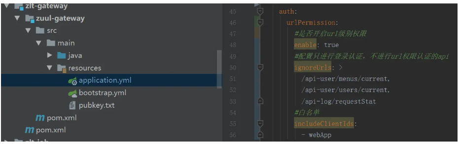

登录认证
一、登录
二、访问后端api需带上token
三、后端api方法不做认证方式
四、获取当前登录人对象
4.1. 方法一获取基本信息
4.2. 方法二获取全部信息
五、获取当前登录的租户
六、token类型切换
七、无网络隔离的系统环境下认证修改
7.1. 把一下内容从api网关移去各个微服务里：
八、token自动续签
九、url级权限
9.1. 打开网关认证配置
9.2. 配置只认证登录，登录后所有角色都能访问的url(可选项)
9.3. 配置白名单/黑名单(可选项)
十、登录同应用同账号互踢
十一、单点登录与单点登出
11.1. demo样例
11.2. 相关文章
十二、手动token鉴权工具
十三、数据权限
一、登录
http://127.0.0.1:8066
admin/admin
 

二、访问后端api需带上token
放header方式：
Authorization:Bearer xxx
​
放参数方式：
http://localhost:9900/api-user/users?access_token=xxx
 

三、后端api方法不做认证方式
zlt:
  security:
    ignore:
      httpUrls: '不想认证拦截的url'
 

四、获取当前登录人对象
在被 access_token 鉴权过的请求的任意层任意方法中使用

无论在 contoller、service 或者 dao 层使用该方法都可以，需要服务满足以下两个条件：

服务依赖 zlt-common-spring-boot-starter
请求的入口方法需要鉴权
4.1. 方法一获取基本信息
SysUser user = LoginUserContextHolder.getUser()
4.2. 方法二获取全部信息
SysUser user = LoginUserUtils.getCurrentSysUser()
 

五、获取当前登录的租户
//例子：
String tenantId = TenantContextHolder.getTenant();
 

六、token类型切换

 

七、无网络隔离的系统环境下认证修改
因为当前的代码是api网关统一认证的架构，适配有网络隔离的环境下使用
而如果无网络隔离的环境下代码需求进行调整，将api网关的认证相关内容移去各个微服务里，架构可参考 无网络隔离认证设计

具体步骤：
7.1. 把一下内容从api网关移去各个微服务里：
zlt-auth-client-spring-boot-starter jar包依赖
ResourceServerConfiguration 资源服务配置
删除UserInfoHeaderFilter类
配置文件里面认证相关配置

pubkey.txt公钥
 

八、token自动续签
目前续签功能只支持redis token模式，请先确保授权服务器和认证服务器的zlt.oauth2.token.store.type=redis
认证服务器开启自动续签功能zlt.security.auth.renew.enable=true
白名单与黑名单功能是非必填项，不配置默认所有应用的token都会续签

自动续签原理：系统设计-认证设计-token自动续签设计

 

九、url级权限
该功能默认关闭，开启需要在网关添加url权限相关配置
配置參考:zlt-gateway\sc-gateway\src\main\resources\application.yml

9.1. 打开网关认证配置
zlt.security.auth.urlPermission.enable设置为true

9.2. 配置只认证登录，登录后所有角色都能访问的url(可选项)
zlt.security.auth.urlPermission.ignoreUrls

9.3. 配置白名单/黑名单(可选项)
zlt.security.auth.urlPermission.includeClientIds
zlt.security.auth.urlPermission.exclusiveClientIds
详情查看：url级权限控制

 

十、登录同应用同账号互踢
实现了在同一个应用id下，不同的浏览器使用相同的用户名登录，相互互踢。

在 zlt-uaa 中通过参数 isSingleLogin 来配置是否开启功能，默认为 false 为可以同时登录，改为 true 则会互踢

zlt:
  security:
    auth:
        isSingleLogin: true
 

十一、单点登录与单点登出
在 zlt-uaa 工程中通过参数 unifiedLogout 来配置是否开启单点登出功能，默认为 false

zlt:
  security:
    auth:
      unifiedLogout: true
11.1. demo样例
zlt-demo\ss-sso：使用springSecurity来实现自动单点登录，非前后端分离
zlt-demo\web-sso：前后端分离的单点登录与单点登出
zlt-demo\oidc-sso：拥有独立用户体系的系统，使用OIDC协议的单点登录与单点登出
11.2. 相关文章
单点登录详解
前后端分离的单点登录
OIDC协议单点登录
单点登出详解
 

十二、手动token鉴权工具
zlt-auth-client-spring-boot-starter 依赖只会对 http 请求进行拦截鉴权。

对于其他协议如 webSocket、dubbo、MQ等如果需要进行 token 鉴权，可手动使用以下方法：

SysUser user = AuthUtils.checkAccessToken(String accessTokenValue)
 

十三、数据权限
在服务的 application.yml 配置中添加以下内容：

zlt:
datascope:
  # 开启数据权限，默认为 false
  enabled: true