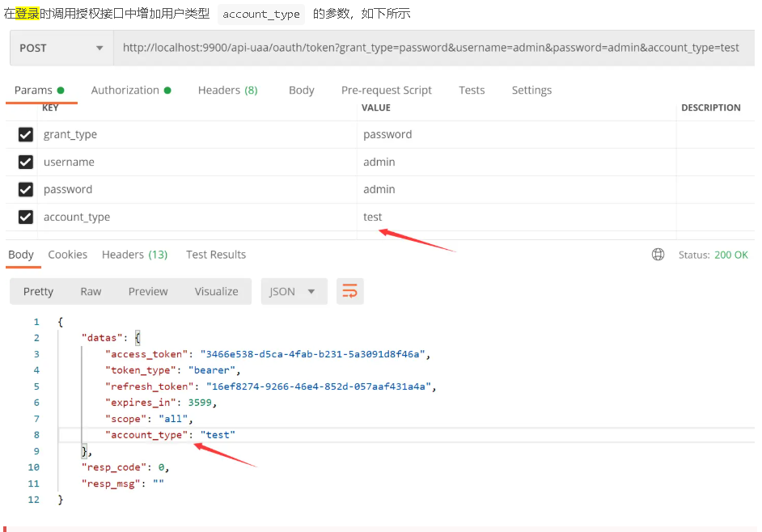
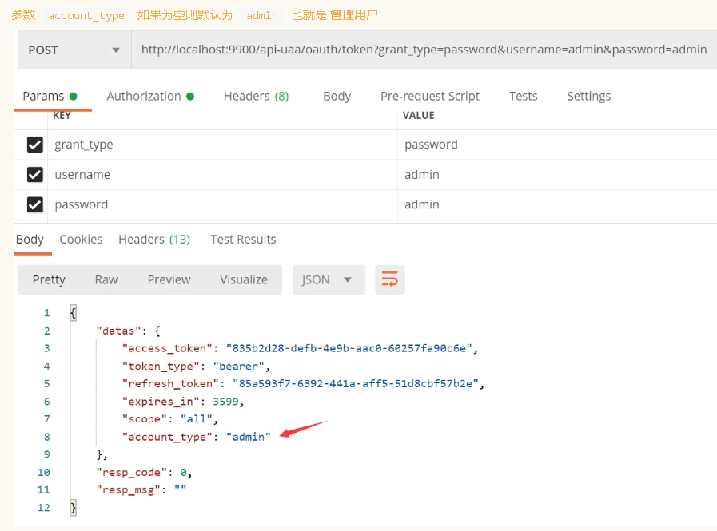
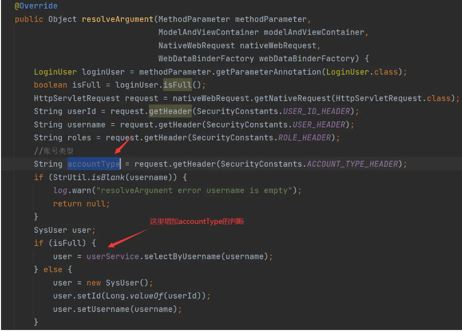

一、概述
二、扩展方式
2.1. 新增用户service实现类
2.2. 修改登录页面
2.3. 获取当前登录人改造
一、概述
多用户类型指的是业务中有多种类型的 用户 ，通常不同类型的用户分别存储在不同的库表中；以淘宝为例，买家和卖家这些都是属于C端的用户，但是肯定也会存在淘宝系统的后台管理员，这个属于B端的用户，两种类型的用户肯定是分离的也就是使用不同的库表。

本框架的统一认证中心uaa支持多用户类型的统一授权和鉴权扩展

由于用户类型是业务方面的内容每个系统都不一样，框架本身不带业务相关的内容，只是提供扩展的方式与思路

二、扩展方式
2.1. 新增用户service实现类
在统一认证中心UAA中增加新的用户类型的实现类，并实现 ZltUserDetailsService，下面为代码样例：

@Service
public class portalUserDetailServiceImpl implements ZltUserDetailsService {
    private static final String ACCOUNT_TYPE = "portal";

    @Resource
    private UserService userService;

    @Override
    public boolean supports(String accountType) {
        return ACCOUNT_TYPE.equals(accountType);
    }

    @Override
    public UserDetails loadUserByUsername(String username) {
        ......
    }
    
    @Override
    public SocialUserDetails loadUserByUserId(String openId) {
        ......
    }

    @Override
    public UserDetails loadUserByMobile(String mobile) {
        ......
    }
}
授权中心会通过 supports 方法来决定使用那个实现类来处理用户的查询逻辑

如果新的用户表在其他数据库，则需要配合 dynamic-datasource-spring-boot-starter 之类的依赖去实现多数据源动态切换

2.2. 修改登录页面
在登录时调用授权接口中增加用户类型 account_type 的参数，如下所示

授权服务器自动会调用 account_type 为 portal 实现类去查询用户信息

2.3. 获取当前登录人改造
修改类 TokenArgumentResolver 中的 resolveArgument 方法，根据变量 accountType 的值分别去调用对应类型的用户服务，如下图所示：

