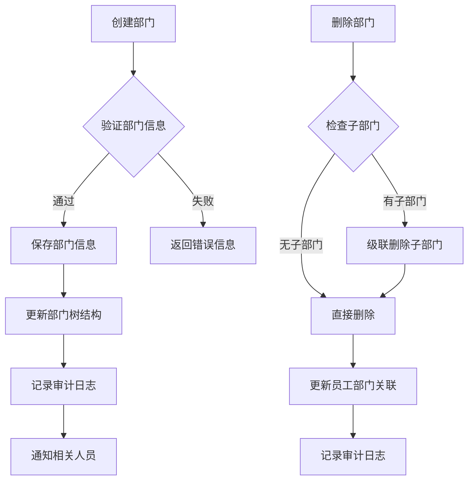
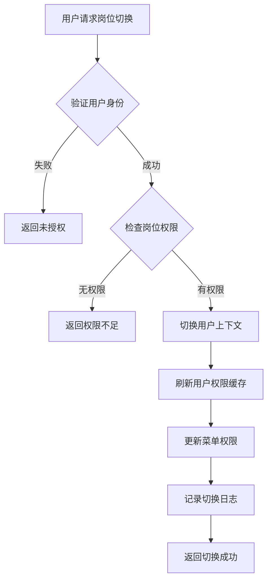
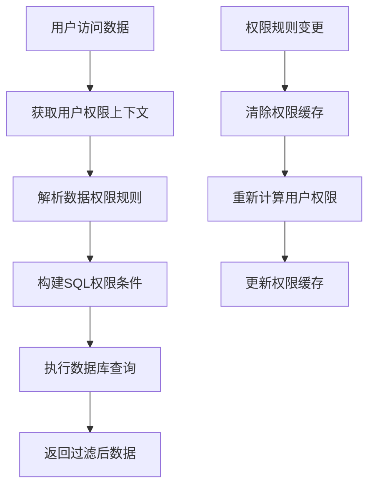

# 组织管理模块需求规格说明书

## 1. 模块概述

### 1.1 业务背景
组织管理模块是Portal 3.0平台的核心基础模块，基于原有SSH系统的组织架构数据模型进行微服务化重构，支持复杂的企业组织结构管理、权限体系和数据权限控制。

### 1.2 设计原则
- **数据继承性**：最大程度复用原有数据库表结构（department、employee、groups等）
- **架构先进性**：采用微服务架构设计，支持多租户和水平扩展
- **权限精细化**：支持到功能点级别的权限控制和数据权限隔离
- **业务连续性**：确保业务流程的完整性和数据的一致性

### 1.3 核心功能
- 部门层级管理（支持7级部门结构）
- 岗位职责配置
- 员工信息管理
- 权限体系控制
- 数据权限隔离
- 审计日志追踪
- 多租户组织架构管理

## 2. 部门管理

### 2.1 功能概述
基于原有`department`表结构，支持7级部门层级管理，区分分公司和半级部门类型，提供完整的部门生命周期管理。

### 2.2 数据模型
```sql
-- 复用并扩展原department表
CREATE TABLE department (
    id int(11) NOT NULL AUTO_INCREMENT COMMENT '部门ID',
    name varchar(128) NOT NULL COMMENT '部门名称',
    directorId int(11) COMMENT '部门主管ID',
    parentId int(11) DEFAULT 0 COMMENT '父部门ID',
    depNo varchar(10) COMMENT '部门编号',
    gradeid int(11) DEFAULT 7 COMMENT '部门等级(1-7级)',
    islevel int(10) COMMENT '部门级别',
    fiiale varchar(11) COMMENT '是否为分公司(1是,空否)',
    filialemark varchar(100) COMMENT '分公司标识',
    tel varchar(50) COMMENT '电话',
    address varchar(255) COMMENT '办公地址',
    description text COMMENT '部门描述',
    sort_order int(11) DEFAULT 0 COMMENT '排序号',
    status tinyint(1) DEFAULT 1 COMMENT '状态(1启用,0禁用)',
    delflag int(11) DEFAULT 0 COMMENT '删除标识(0正常,1删除)',
    Time datetime COMMENT '创建时间',
    -- 新增微服务字段
    created_at timestamp DEFAULT CURRENT_TIMESTAMP COMMENT '创建时间',
    updated_at timestamp DEFAULT CURRENT_TIMESTAMP ON UPDATE CURRENT_TIMESTAMP COMMENT '更新时间',
    tenant_id varchar(32) COMMENT '租户ID',
    created_by int(11) COMMENT '创建人',
    updated_by int(11) COMMENT '更新人',
    PRIMARY KEY (id),
    KEY idx_parent_id (parentId),
    KEY idx_director_id (directorId),
    KEY idx_tenant_id (tenant_id)
) COMMENT='部门表';

-- 部门等级配置表
CREATE TABLE department_grade (
    id int(11) NOT NULL AUTO_INCREMENT COMMENT '部门级别ID',
    dg_num tinyint(4) NOT NULL COMMENT '部门等级数字(1-7)',
    dg_name varchar(32) NOT NULL COMMENT '部门等级名称',
    dg_desc varchar(200) COMMENT '部门等级描述',
    level_weight int(11) DEFAULT 0 COMMENT '级别权重',
    can_manage_lower tinyint(1) DEFAULT 1 COMMENT '是否可管理下级(1是,0否)',
    created_at timestamp DEFAULT CURRENT_TIMESTAMP,
    PRIMARY KEY (id),
    UNIQUE KEY uk_dg_num (dg_num)
) COMMENT='部门等级配置表';
```

### 2.3 界面功能

#### 2.3.1 部门列表展示
- **树形结构显示**：支持无限级展开/折叠的部门树
- **全局操作栏**：
  - 🔍 搜索过滤：支持部门名称、编号、负责人搜索
  - 📂 全局展开：一键展开所有部门及子部门
  - ➕ 新增部门：添加根部门或子部门
  - 📥 批量导入：提供Excel模板下载和批量导入功能
  - 📤 导出数据：导出部门结构数据到Excel

#### 2.3.2 部门节点操作
- **部门信息展示**：
  - 部门名称（点击查看详情）
  - 展开/折叠图标
  - 半级部门标识（带 * 标注）
  - 部门状态标识
- **操作菜单**：
  - 👥 岗位管理：跳转到该部门岗位管理页面
  - 👤 岗位人员管理：跳转到岗位人员分配页面
  - ✏️ 编辑部门：修改部门基本信息
  - 🗑️ 删除部门：软删除部门（级联处理子部门）

#### 2.3.3 部门详情页面
- **基本信息**：部门名称、编号、级别、类型、联系方式
- **组织关系**：父部门、子部门列表、部门路径
- **管理信息**：部门主管、分管领导、管理范围
- **统计数据**：员工总数、岗位数量、子部门数量

### 2.4 业务规则

#### 2.4.1 部门层级规则
- 支持最多7级部门结构（gradeid: 1-7）
- 不允许循环引用（子部门不能成为祖先部门的父部门）
- 部门编号在同级部门中唯一
- 删除部门时，子部门自动级联删除（软删除）

#### 2.4.2 半级部门规则
- 半级部门比上级部门低一级，但比同级部门高半级
- 半级部门员工对同级及同级下属部门具有分管权限
- 半级部门用 `*` 标识，在权限计算时特殊处理

#### 2.4.3 数据权限规则
- 部门主管可查看和管理本部门及下属部门数据
- 半级部门负责人可查看分管部门数据
- 普通员工只能查看本部门公开数据

## 3. 岗位管理

### 3.1 功能概述
基于原有`workposition`和`groups`表结构，提供岗位信息管理、权限配置和分管关系设置。


### 3.3 界面功能

#### 3.3.1 岗位列表
- **列表字段**：
  - 岗位名称
  - 岗位简写  
  - 所属部门
  - 是否主管岗位（图标标识）
  - 在职人数/最大人数
  - 状态
  - 操作菜单
- **查询条件**：部门筛选、岗位类型、状态筛选、关键词搜索
- **批量操作**：批量启用/禁用、批量删除

#### 3.3.2 岗位操作功能
- **分管管理**：
  - 展示当前部门下所有子部门树形结构
  - 半级部门特殊标识显示
  - 多选框支持选择分管部门
  - 分管类型选择（直管/协管）
- **权限管理**：跳转到权限配置页面
- **人员管理**：跳转到岗位人员分配页面
- **编辑岗位**：修改岗位基本信息
- **删除岗位**：删除前检查是否有在职人员

### 3.4 业务规则

#### 3.4.1 分管部门规则
- 岗位分管部门前需验证：
  - 目标部门必须已设置主管岗位
  - 一个部门只能有一个直管领导
  - 协管领导可以有多个
- 分管权限继承：分管岗位员工可切换到分管部门权限
- 分管数据权限：可查看和操作分管部门相关数据

#### 3.4.2 岗位切换功能
- **全局岗位切换器**：用户下拉选择可担任的所有岗位
- **权限切换**：切换岗位后，菜单权限和数据权限同步变更
- **操作审计**：记录岗位切换操作日志

## 4. 员工管理

### 4.1 功能概述
员工管理是组织管理的核心模块，提供员工全生命周期管理，包括员工信息录入、维护、查询、统计等功能。支持扩展信息管理和附件上传，满足企业人力资源管理需求。

### 4.2 功能清单

#### 4.2.1 员工信息管理
- **新增员工**
  - 分步骤表单填写员工信息
  - 自动生成员工编号
  - 支持草稿保存和继续编辑
  - 实时表单验证和重复性检查
  - 批量导入员工信息

- **员工信息维护**
  - 员工基本信息编辑
  - 组织关系调整
  - 在职状态变更
  - 员工等级调整
  - 信息变更历史追踪

- **员工信息查询**
  - 多条件组合搜索
  - 高级筛选功能
  - 员工列表分页展示
  - 员工详情快速查看
  - 组织架构中的员工分布

#### 4.2.2 扩展信息管理
- **家庭成员信息**
  - 家庭成员动态添加/删除
  - 成员信息：姓名、关系、职位、工作单位
  - 家庭关系类型：父亲、母亲、配偶、子女、兄弟姐妹、其他
  - 家庭成员信息批量导入

- **教育经历管理**
  - 教育经历动态添加/删除
  - 经历信息：毕业院校、开始/结束时间、专业、证书、证明人
  - 学历层次：小学、初中、高中、中专、大专、本科、硕士、博士
  - 教育经历时间轴展示

- **工作经验管理**
  - 工作经验动态添加/删除
  - 经验信息：公司、开始/结束时间、职务、收入、离职原因、证明人及联系电话
  - 工作经验连续性检查
  - 工作轨迹可视化展示

#### 4.2.3 附件管理
- **附件上传**
  - 支持多种附件类型：2寸半身照、身份证正反面、毕业证、学位证、笔试成绩、个人全身照等
  - 拖拽上传和点击上传
  - 文件格式限制：图片(jpg,png,gif)、文档(pdf,doc,docx)
  - 文件大小限制：单文件不超过10MB
  - 批量上传支持

- **附件管理**
  - 附件预览功能
  - 附件下载和分享
  - 附件版本管理
  - 附件审核状态跟踪
  - 附件分类归档

#### 4.2.4 员工状态管理
- **在职状态**
  - 在职：正常工作状态
  - 试用：试用期员工
  - 离职：已离职员工
  - 停职：暂时停职员工

- **用工类型**
  - 正式员工：签订正式劳动合同
  - 实习生：在校学生实习
  - 外包员工：外包公司派遣
  - 劳务员工：劳务派遣

#### 4.2.5 统计分析
- **员工统计**
  - 员工总数统计
  - 在职员工数量
  - 试用期员工数量
  - 新入职员工数量
  - 离职员工数量

- **分布分析**
  - 部门员工分布
  - 岗位员工分布
  - 年龄结构分析
  - 学历结构分析
  - 工龄分布统计

### 4.3 数据结构

#### 4.3.1 员工基本信息
```javascript
{
  id: "员工ID",
  empNo: "员工编号",
  name: "姓名",
  nameEn: "英文姓名",
  gender: "性别(1:男,2:女)",
  birthDate: "出生日期",
  idCard: "身份证号",
  mobile: "手机号",
  email: "邮箱",
  departmentId: "部门ID",
  positionId: "主岗位ID",
  secondaryPositionIds: "副岗位ID列表",
  gradeId: "员工等级ID",
  employmentType: "用工类型",
  employmentStatus: "在职状态",
  entryDate: "入职日期",
  probationEndDate: "试用期结束日期",
  leaveDate: "离职日期",
  leaveReason: "离职原因",
  avatar: "头像地址"
}
```

#### 4.3.2 扩展信息结构
```javascript
// 家庭成员
{
  familyMembers: [
    {
      name: "姓名",
      relationship: "关系",
      position: "职位",
      company: "工作单位"
    }
  ]
}

// 教育经历
{
  educationHistory: [
    {
      school: "毕业院校",
      startDate: "开始时间",
      endDate: "结束时间",
      major: "专业",
      degree: "学位/证书",
      referee: "证明人"
    }
  ]
}

// 工作经验
{
  workExperience: [
    {
      company: "公司",
      startDate: "开始时间",
      endDate: "结束时间",
      position: "职务",
      salary: "收入",
      leaveReason: "离职原因",
      referee: "证明人",
      refereePhone: "证明人联系电话"
    }
  ]
}
```

### 4.4 业务规则

#### 4.4.1 员工编号规则
- 自动生成，格式：EMP + 年份 + 4位序号（如：EMP20240001）
- 全局唯一，不可重复
- 离职员工编号不可重用

#### 4.4.2 必填字段规则
- 基本信息：姓名、性别、手机号、部门、岗位
- 身份验证：身份证号（中国大陆员工必填）
- 组织信息：入职日期、用工类型、在职状态

#### 4.4.3 数据验证规则
- 手机号：11位数字，符合中国手机号格式
- 邮箱：符合标准邮箱格式
- 身份证：18位，通过身份证校验算法
- 入职日期：不能晚于当前日期
- 试用期结束日期：不能早于入职日期

#### 4.4.4 权限控制规则
- 员工本人：查看自己的基本信息和扩展信息
- 直接主管：查看下属员工完整信息，编辑部分字段
- HR人员：查看和编辑所有员工信息
- 部门负责人：查看本部门员工信息
- 系统管理员：完整的员工数据管理权限

#### 4.4.5 审批流程规则
- 员工入职：HR录入 → 部门确认 → 系统激活
- 信息变更：申请人提交 → 主管审批 → HR确认
- 组织调动：原部门主管 → 新部门主管 → HR审批
- 离职申请：员工申请 → 直接主管 → 部门负责人 → HR审批

## 5. 岗位权限配置管理

### 5.1 功能概述
岗位权限配置是Portal 3.0组织管理的核心功能，基于原有的workposition表和groups表重构，实现从"角色权限"到"岗位权限"的转变，提供更精细化、更贴合企业实际组织结构的权限管理方案。

### 5.2 设计理念

#### 5.2.1 岗位化权限管理
- **权限主体转变**：从基于"角色"的权限管理转变为基于"岗位"的权限管理
- **组织结构映射**：权限配置直接映射到企业的岗位体系，更符合管理实际
- **精细化控制**：支持到具体功能点的权限控制，满足企业精细化管理需求
- **动态权限切换**：员工可在其担任的多个岗位间切换，获得对应权限

#### 5.2.2 双面板交互设计
- **左侧岗位面板**：展示企业所有岗位，支持搜索和筛选
- **右侧权限面板**：展示选中岗位的功能权限配置
- **即时响应**：点击岗位立即切换对应的权限配置界面
- **状态联动**：权限勾选状态支持全选、半选的智能联动

### 5.3 界面功能设计

#### 5.3.1 岗位列表面板（左侧）
**布局结构**：
- 面板标题：显示"岗位列表"和岗位总数统计
- 搜索框：支持按岗位名称、部门名称进行实时搜索
- 岗位列表：以卡片形式展示岗位信息

**岗位卡片信息**：
```
┌─────────────────────────┐
│ 岗位名称                │
│ 所属部门    [权重等级]   │
└─────────────────────────┘
```

**交互特性**：
- 点击岗位卡片切换到对应的权限配置
- 当前选中岗位高亮显示（蓝色边框+背景色）
- 支持键盘上下键快速切换岗位选择

#### 5.3.2 权限配置面板（右侧）
**面板头部**：
- 标题："功能权限配置"
- 操作按钮：全部展开、全部折叠、保存配置

**选中岗位信息区**：
```
┌─────────────────────────────────────┐
│ 技术总监                            │
│ 所属部门：技术部    岗位级别：总经理级│
└─────────────────────────────────────┘
```

**权限树结构**：
```
🏢 组织架构 ☑️
├── 部门管理 ☑️
│   ├── ☑️ 查看部门
│   ├── ☑️ 新增部门
│   ├── ☑️ 编辑部门
│   └── ☐ 删除部门
├── 员工管理 ☐
└── 岗位管理 ☑️

👥 客户关系管理 ☑️
├── 客户管理 ☑️
└── 跟进管理 ☐
```

### 5.4 权限模块结构

#### 5.4.1 模块分层设计
**三级权限结构**：
1. **一级模块**：系统的主要功能模块（如：组织架构、CRM、产品管理）
2. **二级功能组**：模块下的功能分组（如：部门管理、员工管理）
3. **三级功能点**：具体的操作权限（如：查看、新增、编辑、删除）

#### 5.4.2 权限模块定义
```javascript
const permissionModules = [
  {
    id: 'organization',
    name: '组织架构',
    icon: '🏢',
    functions: [
      {
        groupName: '部门管理',
        permissions: [
          { code: 'dept_view', name: '查看部门' },
          { code: 'dept_add', name: '新增部门' },
          { code: 'dept_edit', name: '编辑部门' },
          { code: 'dept_delete', name: '删除部门' }
        ]
      },
      {
        groupName: '员工管理',
        permissions: [
          { code: 'emp_view', name: '查看员工' },
          { code: 'emp_add', name: '新增员工' },
          { code: 'emp_edit', name: '编辑员工' },
          { code: 'emp_delete', name: '删除员工' }
        ]
      },
      {
        groupName: '岗位管理',
        permissions: [
          { code: 'pos_view', name: '查看岗位' },
          { code: 'pos_add', name: '新增岗位' },
          { code: 'pos_edit', name: '编辑岗位' },
          { code: 'pos_delete', name: '删除岗位' },
          { code: 'pos_permission', name: '配置权限' }
        ]
      }
    ]
  },
  {
    id: 'crm',
    name: '客户关系管理',
    icon: '👥',
    functions: [
      {
        groupName: '客户管理',
        permissions: [
          { code: 'customer_view', name: '查看客户' },
          { code: 'customer_add', name: '新增客户' },
          { code: 'customer_edit', name: '编辑客户' },
          { code: 'customer_delete', name: '删除客户' },
          { code: 'customer_transfer', name: '客户转移' }
        ]
      }
    ]
  }
  // ... 其他模块
];
```

### 5.5 数据模型设计

#### 5.5.1 权限存储结构
**JSON格式权限配置**：
```javascript
{
  permissions: {
    organization: {
      department: {
        view: true,
        add: true,
        edit: true,
        delete: false
      },
      employee: {
        view: true,
        add: false,
        edit: false,
        delete: false
      },
      position: {
        view: true,
        add: true,
        edit: true,
        delete: true
      }
    },
    crm: {
      customer: {
        view: true,
        add: true,
        edit: true,
        delete: false,
        transfer: true
      },
      follow: {
        view: true,
        add: true,
        edit: true,
        delete: false
      }
    },
    product: {
      category: {
        view: true,
        add: false,
        edit: false,
        delete: false
      },
      product: {
        view: true,
        add: true,
        edit: true,
        delete: false
      }
    }
    // ... 其他模块权限
  },
  functionIDs: "1,2,3,5,8,9,12,15,18,20,25,28" // 兼容原系统的功能ID串
}
```

#### 5.5.2 数据库表结构
```sql
-- 岗位权限表（扩展原workposition表）
ALTER TABLE workposition ADD COLUMN permissions text COMMENT '权限配置JSON';
ALTER TABLE workposition ADD COLUMN functionIDs varchar(500) COMMENT '功能权限ID串';
ALTER TABLE workposition ADD COLUMN workgrade int(11) DEFAULT 1 COMMENT '权重等级(1-5)';
ALTER TABLE workposition ADD COLUMN workcontent text COMMENT '工作职责';
ALTER TABLE workposition ADD COLUMN edittime datetime COMMENT '最后编辑时间';

-- 权限功能点表
CREATE TABLE permission_function (
    id int(11) NOT NULL AUTO_INCREMENT COMMENT '功能ID',
    function_code varchar(100) NOT NULL COMMENT '功能代码',
    function_name varchar(100) NOT NULL COMMENT '功能名称',
    module_code varchar(50) NOT NULL COMMENT '模块代码',
    group_code varchar(50) NOT NULL COMMENT '分组代码',
    parent_id int(11) DEFAULT 0 COMMENT '父功能ID',
    sort_order int(11) DEFAULT 0 COMMENT '排序号',
    status tinyint(1) DEFAULT 1 COMMENT '状态',
    created_at timestamp DEFAULT CURRENT_TIMESTAMP,
    tenant_id varchar(32) COMMENT '租户ID',
    PRIMARY KEY (id),
    UNIQUE KEY uk_function_code (function_code, tenant_id),
    KEY idx_module_code (module_code),
    KEY idx_group_code (group_code)
) COMMENT='权限功能点表';
```

### 5.6 交互逻辑实现

#### 5.6.1 权限状态联动
**模块级联动**：
- 勾选模块复选框：该模块下所有功能权限被选中
- 取消模块复选框：该模块下所有功能权限被取消
- 部分功能被选中时：模块复选框显示半选状态（indeterminate）

**功能组级联动**：
- 勾选功能组复选框：该组下所有具体功能被选中
- 取消功能组复选框：该组下所有具体功能被取消
- 部分功能被选中时：功能组复选框显示半选状态

**代码实现**：
```javascript
// 更新权限状态联动
function updatePermissionState() {
    // 更新功能组复选框状态
    document.querySelectorAll('.function-group-checkbox').forEach(groupCheckbox => {
        const functionCheckboxes = document.querySelectorAll(
            `input[data-group="${groupCheckbox.dataset.group}"].function-checkbox`
        );
        
        const checkedCount = Array.from(functionCheckboxes).filter(cb => cb.checked).length;
        groupCheckbox.checked = checkedCount === functionCheckboxes.length;
        groupCheckbox.indeterminate = checkedCount > 0 && checkedCount < functionCheckboxes.length;
    });
    
    // 更新模块复选框状态
    document.querySelectorAll('.module-checkbox').forEach(moduleCheckbox => {
        const allCheckboxes = moduleCheckbox.closest('.permission-module')
            .querySelectorAll('.function-checkbox');
        
        const checkedCount = Array.from(allCheckboxes).filter(cb => cb.checked).length;
        moduleCheckbox.checked = checkedCount === allCheckboxes.length;
        moduleCheckbox.indeterminate = checkedCount > 0 && checkedCount < allCheckboxes.length;
    });
}
```

#### 5.6.2 权限保存机制
**数据收集**：
```javascript
function savePermissions() {
    const permissions = {};
    const functionIds = [];
    
    // 收集所有选中的权限
    document.querySelectorAll('.function-checkbox:checked').forEach((checkbox, index) => {
        const module = checkbox.dataset.module;
        const group = checkbox.dataset.group;
        const permission = checkbox.dataset.permission;
        
        if (!permissions[module]) permissions[module] = {};
        if (!permissions[module][group]) permissions[module][group] = {};
        
        permissions[module][group][permission] = true;
        functionIds.push(index + 1);
    });
    
    // 更新岗位权限配置
    updatePositionPermissions(currentPosition.id, {
        permissions: permissions,
        functionIDs: functionIds.join(','),
        editTime: new Date().toISOString()
    });
}
```

### 5.7 业务规则和约束

#### 5.7.1 权限配置规则
- **权限下钻原则**：只能为岗位配置不超过其上级岗位的权限
- **权限互斥检查**：检测权限配置是否存在逻辑冲突
- **必要权限保障**：某些关键岗位的基础权限不可删除
- **权限继承机制**：下级岗位可继承上级岗位的基础权限

#### 5.7.2 数据完整性约束
- **岗位权限关联**：删除岗位时需要检查权限配置依赖
- **功能权限映射**：确保权限代码与实际功能点的一致性
- **版本兼容性**：新增功能权限时保持向下兼容
- **权限审计追踪**：记录所有权限变更的操作日志

### 5.8 权限管理体系

#### 5.8.1 权限架构设计

#### 5.8.1 权限模型
```
用户 → 员工 → 岗位 → 功能权限
     ↘    ↘         ↗
       个人权限 ← 权限授权
```

### 5.2 数据权限管理

#### 5.2.1 数据权限模型
```sql
-- 数据权限规则表
CREATE TABLE data_permission_rule (
    id int(11) NOT NULL AUTO_INCREMENT COMMENT '规则ID',
    rule_name varchar(100) NOT NULL COMMENT '规则名称',
    rule_code varchar(50) NOT NULL COMMENT '规则代码',
    rule_type tinyint(1) NOT NULL COMMENT '规则类型(1部门,2岗位,3个人,4自定义)',
    target_table varchar(100) COMMENT '目标表名',
    condition_sql text COMMENT '权限条件SQL',
    is_enabled tinyint(1) DEFAULT 1 COMMENT '是否启用',
    priority int(11) DEFAULT 0 COMMENT '优先级',
    description varchar(500) COMMENT '规则描述',
    created_at timestamp DEFAULT CURRENT_TIMESTAMP,
    tenant_id varchar(32) COMMENT '租户ID',
    PRIMARY KEY (id),
    UNIQUE KEY uk_rule_code (rule_code, tenant_id)
) COMMENT='数据权限规则表';

-- 用户数据权限表
CREATE TABLE user_data_permission (
    id int(11) NOT NULL AUTO_INCREMENT,
    user_id int(11) NOT NULL COMMENT '用户ID',
    rule_id int(11) NOT NULL COMMENT '规则ID',
    permission_scope varchar(100) COMMENT '权限范围',
    condition_value varchar(500) COMMENT '条件值',
    is_enabled tinyint(1) DEFAULT 1 COMMENT '是否启用',
    effective_date date COMMENT '生效日期',
    expire_date date COMMENT '失效日期',
    created_at timestamp DEFAULT CURRENT_TIMESTAMP,
    PRIMARY KEY (id),
    KEY idx_user_id (user_id),
    KEY idx_rule_id (rule_id)
) COMMENT='用户数据权限表';
```

#### 5.2.2 数据权限类型
- **部门数据权限**：
  - 本部门：仅能查看本部门数据
  - 本部门及下级：能查看本部门及所有下级部门数据
  - 分管部门：能查看分管的部门数据
  - 全部部门：能查看所有部门数据
- **个人数据权限**：
  - 仅本人：只能查看本人创建的数据
  - 本人及下级：能查看本人及下级创建的数据
- **自定义权限**：支持自定义SQL条件进行数据过滤

### 5.3 权限配置界面

#### 5.3.1 权限组管理
- **权限组列表**：支持树形展示权限组层次结构
- **权限配置**：勾选式权限分配界面，支持批量操作
- **权限预览**：实时预览权限组包含的所有权限
- **权限测试**：可以指定用户测试权限效果

#### 5.3.2 个人权限管理
- **权限授权**：为特定用户授予额外权限
- **权限撤销**：撤销用户的特定权限
- **权限审批**：高级权限需要审批流程
- **权限审计**：记录所有权限变更操作

## 6. 审计日志

### 6.1 数据模型
```sql
-- 操作日志表
CREATE TABLE audit_log (
    id bigint(20) NOT NULL AUTO_INCREMENT COMMENT '日志ID',
    user_id int(11) COMMENT '操作用户ID',
    user_name varchar(50) COMMENT '操作用户名',
    module varchar(50) COMMENT '操作模块',
    operation varchar(100) COMMENT '操作类型',
    target_type varchar(50) COMMENT '目标类型',
    target_id varchar(100) COMMENT '目标ID',
    target_name varchar(200) COMMENT '目标名称',
    operation_desc varchar(500) COMMENT '操作描述',
    old_value text COMMENT '变更前值',
    new_value text COMMENT '变更后值',
    ip_address varchar(50) COMMENT 'IP地址',
    user_agent varchar(500) COMMENT '用户代理',
    operation_time timestamp DEFAULT CURRENT_TIMESTAMP COMMENT '操作时间',
    tenant_id varchar(32) COMMENT '租户ID',
    PRIMARY KEY (id),
    KEY idx_user_id (user_id),
    KEY idx_operation_time (operation_time),
    KEY idx_module (module)
) COMMENT='审计日志表';
```

### 6.2 审计范围
- **部门操作**：新增、修改、删除、启用/禁用
- **岗位操作**：创建、编辑、权限变更、删除
- **员工操作**：入职、调岗、离职、权限变更
- **权限操作**：权限授予、撤销、权限组变更
- **登录日志**：登录、退出、岗位切换

## 7. API接口设计

### 7.1 部门管理接口
```java
@RestController
@RequestMapping("/api/organization/department")
public class DepartmentController {
    
    /**
     * 获取部门树
     */
    @GetMapping("/tree")
    public Result<List<DepartmentTreeVO>> getDepartmentTree(
            @RequestParam(required = false) Integer parentId,
            @RequestParam(required = false) Boolean includeDisabled) {
        // 实现逻辑
    }
    
    /**
     * 创建部门
     */
    @PostMapping
    public Result<DepartmentVO> createDepartment(@RequestBody @Valid DepartmentCreateDTO dto) {
        // 实现逻辑
    }
    
    /**
     * 更新部门
     */
    @PutMapping("/{id}")
    public Result<DepartmentVO> updateDepartment(
            @PathVariable Integer id, 
            @RequestBody @Valid DepartmentUpdateDTO dto) {
        // 实现逻辑
    }
    
    /**
     * 删除部门
     */
    @DeleteMapping("/{id}")
    public Result<Void> deleteDepartment(@PathVariable Integer id) {
        // 实现逻辑
    }
    
    /**
     * 批量导入部门
     */
    @PostMapping("/import")
    public Result<ImportResultVO> importDepartments(@RequestParam("file") MultipartFile file) {
        // 实现逻辑
    }
}
```

### 7.2 岗位管理接口
```java
@RestController
@RequestMapping("/api/organization/position")
public class PositionController {
    
    /**
     * 获取岗位列表
     */
    @GetMapping
    public Result<PageResult<PositionVO>> getPositions(
            @RequestParam(required = false) Integer departmentId,
            @RequestParam(required = false) String keyword,
            @RequestParam(defaultValue = "1") Integer page,
            @RequestParam(defaultValue = "20") Integer size) {
        // 实现逻辑
    }
    
    /**
     * 配置岗位分管部门
     */
    @PostMapping("/{positionId}/manage-departments")
    public Result<Void> configManageDepartments(
            @PathVariable Integer positionId,
            @RequestBody List<ManageDepartmentDTO> departments) {
        // 实现逻辑
    }
    
    /**
     * 配置岗位权限
     */
    @PostMapping("/{positionId}/permissions")
    public Result<Void> configPositionPermissions(
            @PathVariable Integer positionId,
            @RequestBody PositionPermissionDTO permissions) {
        // 实现逻辑
    }
}
```

### 7.3 员工管理接口
```java
@RestController
@RequestMapping("/api/organization/employee")
public class EmployeeController {
    
    /**
     * 获取员工列表
     */
    @GetMapping
    public Result<PageResult<EmployeeVO>> getEmployees(EmployeeQueryDTO query) {
        // 实现逻辑
    }
    
    /**
     * 员工岗位切换
     */
    @PostMapping("/switch-position")
    public Result<UserPositionVO> switchPosition(@RequestBody PositionSwitchDTO dto) {
        // 实现逻辑
    }
    
    /**
     * 获取用户可切换岗位列表
     */
    @GetMapping("/available-positions/{userId}")
    public Result<List<PositionOptionVO>> getAvailablePositions(@PathVariable Integer userId) {
        // 实现逻辑
    }
}
```

## 8. 业务流程

### 8.1 部门管理流程


### 8.2 权限切换流程


### 8.3 数据权限控制流程


## 9. 技术实现要点

### 9.1 权限缓存策略
- **Redis缓存**：用户权限信息缓存2小时
- **多级缓存**：JVM本地缓存 + Redis分布式缓存
- **缓存更新**：权限变更时主动清除相关缓存
- **缓存预热**：系统启动时预加载常用权限数据

### 9.2 数据权限实现
- **MyBatis拦截器**：自动在SQL中添加数据权限条件
- **ThreadLocal上下文**：传递当前用户权限信息
- **SQL解析**：使用JSQLParser解析和修改SQL语句
- **条件合并**：支持多个权限条件的AND/OR组合

### 9.3 性能优化
- **懒加载**：按需加载部门树结构
- **批量查询**：减少数据库查询次数
- **索引优化**：为常用查询字段添加索引
- **分页查询**：大数据量列表采用分页展示

## 10. 部署和运维

### 10.1 数据库部署
- **主从复制**：支持读写分离
- **分库分表**：按租户ID进行数据分片
- **备份策略**：每日增量备份，每周全量备份
- **监控告警**：数据库性能和空间监控

### 10.2 应用部署
- **容器化部署**：使用Docker容器部署
- **负载均衡**：支持多实例水平扩展
- **配置管理**：使用Nacos进行配置管理
- **健康检查**：应用健康状态监控

### 10.3 监控告警
- **性能监控**：接口响应时间、QPS监控
- **错误监控**：异常日志收集和告警
- **业务监控**：关键业务指标监控
- **审计监控**：敏感操作实时告警

## 11. 测试策略

### 11.1 单元测试
- **Service层测试**：业务逻辑单元测试
- **Repository层测试**：数据访问层测试
- **工具类测试**：公共工具方法测试
- **覆盖率要求**：核心业务代码覆盖率≥80%

### 11.2 集成测试
- **API接口测试**：使用Postman/JMeter进行接口测试
- **数据库测试**：数据完整性和一致性测试
- **权限测试**：权限控制正确性验证
- **性能测试**：高并发场景性能测试

### 11.3 用户验收测试
- **功能测试**：按照需求逐项验证功能
- **易用性测试**：用户界面和操作流程测试
- **兼容性测试**：不同浏览器和设备兼容性
- **数据迁移测试**：原系统数据迁移验证

## 12. 多租户组织架构管理

### 12.1 多租户数据隔离

#### 12.1.1 租户上下文管理
```java
// 租户上下文工具类
@Component
public class TenantContext {
    
    private static final ThreadLocal<String> TENANT_ID = new ThreadLocal<>();
    
    public static void setTenantId(String tenantId) {
        TENANT_ID.set(tenantId);
    }
    
    public static String getTenantId() {
        return TENANT_ID.get();
    }
    
    public static void clear() {
        TENANT_ID.remove();
    }
}

// 租户拦截器
@Component
public class TenantInterceptor implements HandlerInterceptor {
    
    @Override
    public boolean preHandle(HttpServletRequest request, HttpServletResponse response, 
                           Object handler) throws Exception {
        
        // 从请求头或域名中获取租户ID
        String tenantId = extractTenantId(request);
        if (StringUtils.isBlank(tenantId)) {
            throw new TenantNotFoundException("租户信息不存在");
        }
        
        // 设置租户上下文
        TenantContext.setTenantId(tenantId);
        return true;
    }
    
    @Override
    public void afterCompletion(HttpServletRequest request, HttpServletResponse response, 
                              Object handler, Exception ex) throws Exception {
        TenantContext.clear();
    }
}
```

#### 12.1.2 MyBatis多租户拦截器
```java
// 多租户SQL拦截器
@Intercepts({
    @Signature(type = Executor.class, method = "query", 
               args = {MappedStatement.class, Object.class, RowBounds.class, ResultHandler.class}),
    @Signature(type = Executor.class, method = "update", 
               args = {MappedStatement.class, Object.class})
})
public class TenantSqlInterceptor implements Interceptor {
    
    @Override
    public Object intercept(Invocation invocation) throws Throwable {
        
        String tenantId = TenantContext.getTenantId();
        if (StringUtils.isBlank(tenantId)) {
            return invocation.proceed();
        }
        
        MappedStatement mappedStatement = (MappedStatement) invocation.getArgs()[0];
        Object parameter = invocation.getArgs()[1];
        
        // 获取原始SQL
        BoundSql boundSql = mappedStatement.getBoundSql(parameter);
        String sql = boundSql.getSql();
        
        // 解析SQL并添加租户条件
        String newSql = addTenantCondition(sql, tenantId);
        
        // 创建新的MappedStatement
        MappedStatement newMs = copyFromMappedStatement(mappedStatement, newSql);
        invocation.getArgs()[0] = newMs;
        
        return invocation.proceed();
    }
    
    private String addTenantCondition(String sql, String tenantId) {
        // 使用JSQLParser解析SQL并添加tenant_id条件
        try {
            Statement statement = CCJSqlParserUtil.parse(sql);
            
            if (statement instanceof Select) {
                Select select = (Select) statement;
                PlainSelect plainSelect = (PlainSelect) select.getSelectBody();
                
                // 添加WHERE条件
                Expression tenantCondition = new EqualsTo(
                    new Column("tenant_id"), 
                    new StringValue(tenantId)
                );
                
                if (plainSelect.getWhere() == null) {
                    plainSelect.setWhere(tenantCondition);
                } else {
                    AndExpression andExpression = new AndExpression(
                        plainSelect.getWhere(), tenantCondition);
                    plainSelect.setWhere(andExpression);
                }
            } else if (statement instanceof Update) {
                // 处理UPDATE语句
                Update update = (Update) statement;
                Expression tenantCondition = new EqualsTo(
                    new Column("tenant_id"), 
                    new StringValue(tenantId)
                );
                
                if (update.getWhere() == null) {
                    update.setWhere(tenantCondition);
                } else {
                    AndExpression andExpression = new AndExpression(
                        update.getWhere(), tenantCondition);
                    update.setWhere(andExpression);
                }
            } else if (statement instanceof Delete) {
                // 处理DELETE语句
                Delete delete = (Delete) statement;
                Expression tenantCondition = new EqualsTo(
                    new Column("tenant_id"), 
                    new StringValue(tenantId)
                );
                
                if (delete.getWhere() == null) {
                    delete.setWhere(tenantCondition);
                } else {
                    AndExpression andExpression = new AndExpression(
                        delete.getWhere(), tenantCondition);
                    delete.setWhere(andExpression);
                }
            }
            
            return statement.toString();
        } catch (JSQLParserException e) {
            log.warn("SQL解析失败，使用原始SQL: {}", sql);
            return sql;
        }
    }
}
```

### 12.2 租户级组织架构管理

#### 12.2.1 租户部门管理
```java
@RestController
@RequestMapping("/api/tenant/organization/department")
public class TenantDepartmentController {
    
    @Autowired
    private TenantDepartmentService tenantDepartmentService;
    
    /**
     * 获取租户部门树
     */
    @GetMapping("/tree")
    public Result<List<DepartmentTreeVO>> getTenantDepartmentTree() {
        String tenantId = TenantContext.getTenantId();
        List<DepartmentTreeVO> tree = tenantDepartmentService.getDepartmentTree(tenantId);
        return Result.success(tree);
    }
    
    /**
     * 初始化租户组织架构
     */
    @PostMapping("/init")
    public Result<Void> initTenantOrganization(@RequestBody TenantOrgInitDTO dto) {
        String tenantId = TenantContext.getTenantId();
        tenantDepartmentService.initTenantOrganization(tenantId, dto);
        return Result.success();
    }
    
    /**
     * 批量导入租户组织架构
     */
    @PostMapping("/import")
    public Result<ImportResultVO> importTenantOrganization(
            @RequestParam("file") MultipartFile file) {
        String tenantId = TenantContext.getTenantId();
        ImportResultVO result = tenantDepartmentService.importOrganization(tenantId, file);
        return Result.success(result);
    }
}
```

#### 12.2.2 租户数据模型扩展
```sql
-- 租户组织配置表
CREATE TABLE tenant_org_config (
    id int(11) NOT NULL AUTO_INCREMENT,
    tenant_id varchar(32) NOT NULL COMMENT '租户ID',
    max_dept_levels int(11) DEFAULT 7 COMMENT '最大部门层级',
    max_employees int(11) DEFAULT 1000 COMMENT '最大员工数',
    max_positions int(11) DEFAULT 100 COMMENT '最大岗位数',
    enable_half_dept tinyint(1) DEFAULT 1 COMMENT '是否启用半级部门',
    enable_multi_position tinyint(1) DEFAULT 1 COMMENT '是否支持多岗位',
    dept_code_rule varchar(100) COMMENT '部门编码规则',
    emp_code_rule varchar(100) COMMENT '员工编码规则',
    created_at timestamp DEFAULT CURRENT_TIMESTAMP,
    updated_at timestamp DEFAULT CURRENT_TIMESTAMP ON UPDATE CURRENT_TIMESTAMP,
    PRIMARY KEY (id),
    UNIQUE KEY uk_tenant_id (tenant_id)
) COMMENT='租户组织配置表';

-- 租户组织初始化模板
CREATE TABLE tenant_org_template (
    id int(11) NOT NULL AUTO_INCREMENT,
    template_name varchar(100) NOT NULL COMMENT '模板名称',
    template_type varchar(20) NOT NULL COMMENT '模板类型(startup,small,medium,large)',
    description varchar(500) COMMENT '模板描述',
    dept_structure text COMMENT '部门结构JSON',
    position_structure text COMMENT '岗位结构JSON',
    permission_structure text COMMENT '权限结构JSON',
    is_default tinyint(1) DEFAULT 0 COMMENT '是否默认模板',
    sort_order int(11) DEFAULT 0 COMMENT '排序号',
    status tinyint(1) DEFAULT 1 COMMENT '状态',
    created_at timestamp DEFAULT CURRENT_TIMESTAMP,
    PRIMARY KEY (id)
) COMMENT='租户组织初始化模板';
```

### 12.3 租户组织功能限制

#### 12.3.1 资源配额管理
```java
@Service
public class TenantQuotaService {
    
    /**
     * 检查部门数量配额
     */
    public void checkDepartmentQuota(String tenantId) {
        TenantOrgConfig config = getTenantOrgConfig(tenantId);
        int currentDeptCount = departmentService.countByTenant(tenantId);
        
        if (currentDeptCount >= config.getMaxDepartments()) {
            throw new QuotaExceededException("部门数量已达上限: " + config.getMaxDepartments());
        }
    }
    
    /**
     * 检查员工数量配额
     */
    public void checkEmployeeQuota(String tenantId) {
        TenantOrgConfig config = getTenantOrgConfig(tenantId);
        int currentEmpCount = employeeService.countByTenant(tenantId);
        
        if (currentEmpCount >= config.getMaxEmployees()) {
            throw new QuotaExceededException("员工数量已达上限: " + config.getMaxEmployees());
        }
    }
    
    /**
     * 检查岗位数量配额
     */
    public void checkPositionQuota(String tenantId) {
        TenantOrgConfig config = getTenantOrgConfig(tenantId);
        int currentPosCount = positionService.countByTenant(tenantId);
        
        if (currentPosCount >= config.getMaxPositions()) {
            throw new QuotaExceededException("岗位数量已达上限: " + config.getMaxPositions());
        }
    }
}
```

#### 12.3.2 功能权限控制
```java
// 租户功能权限注解
@Target({ElementType.METHOD, ElementType.TYPE})
@Retention(RetentionPolicy.RUNTIME)
public @interface TenantFeature {
    String value(); // 功能代码
    boolean required() default true; // 是否必需
}

// 租户功能权限拦截器
@Component
public class TenantFeatureInterceptor implements HandlerInterceptor {
    
    @Autowired
    private TenantModuleService tenantModuleService;
    
    @Override
    public boolean preHandle(HttpServletRequest request, HttpServletResponse response, 
                           Object handler) throws Exception {
        
        if (!(handler instanceof HandlerMethod)) {
            return true;
        }
        
        HandlerMethod handlerMethod = (HandlerMethod) handler;
        TenantFeature feature = handlerMethod.getMethodAnnotation(TenantFeature.class);
        
        if (feature == null) {
            feature = handlerMethod.getBeanType().getAnnotation(TenantFeature.class);
        }
        
        if (feature == null) {
            return true;
        }
        
        String tenantId = TenantContext.getTenantId();
        boolean hasFeature = tenantModuleService.hasFeature(tenantId, feature.value());
        
        if (!hasFeature && feature.required()) {
            throw new FeatureNotEnabledException("功能未开启: " + feature.value());
        }
        
        return true;
    }
}
```

### 12.4 租户数据迁移

#### 12.4.1 组织架构数据迁移
```java
@Service
public class TenantDataMigrationService {
    
    /**
     * 迁移组织架构数据到新租户
     */
    @Transactional
    public void migrateOrganizationData(String sourceTenantId, String targetTenantId) {
        
        // 1. 迁移部门数据
        List<Department> departments = departmentService.listByTenant(sourceTenantId);
        for (Department dept : departments) {
            Department newDept = dept.clone();
            newDept.setId(null);
            newDept.setTenantId(targetTenantId);
            departmentService.save(newDept);
        }
        
        // 2. 迁移岗位数据
        List<WorkPosition> positions = positionService.listByTenant(sourceTenantId);
        for (WorkPosition pos : positions) {
            WorkPosition newPos = pos.clone();
            newPos.setId(null);
            newPos.setTenantId(targetTenantId);
            positionService.save(newPos);
        }
        
        // 3. 迁移员工数据
        List<Employee> employees = employeeService.listByTenant(sourceTenantId);
        for (Employee emp : employees) {
            Employee newEmp = emp.clone();
            newEmp.setId(null);
            newEmp.setTenantId(targetTenantId);
            employeeService.save(newEmp);
        }
        
        // 4. 迁移权限配置
        migratePermissionData(sourceTenantId, targetTenantId);
    }
    
    /**
     * 导出租户组织架构数据
     */
    public TenantOrgExportVO exportTenantOrgData(String tenantId) {
        TenantOrgExportVO exportVO = new TenantOrgExportVO();
        
        exportVO.setDepartments(departmentService.listByTenant(tenantId));
        exportVO.setPositions(positionService.listByTenant(tenantId));
        exportVO.setEmployees(employeeService.listByTenant(tenantId));
        exportVO.setPermissions(permissionService.listByTenant(tenantId));
        
        return exportVO;
    }
}
```

### 12.5 租户组织监控

#### 12.5.1 组织架构使用统计
```java
@RestController
@RequestMapping("/api/tenant/organization/statistics")
public class TenantOrgStatisticsController {
    
    /**
     * 获取租户组织架构统计
     */
    @GetMapping("/overview")
    public Result<TenantOrgStatisticsVO> getTenantOrgStatistics() {
        String tenantId = TenantContext.getTenantId();
        TenantOrgStatisticsVO statistics = statisticsService.getTenantOrgStatistics(tenantId);
        return Result.success(statistics);
    }
    
    /**
     * 获取部门人员分布统计
     */
    @GetMapping("/department-distribution")
    public Result<List<DeptEmployeeDistributionVO>> getDepartmentDistribution() {
        String tenantId = TenantContext.getTenantId();
        List<DeptEmployeeDistributionVO> distribution = 
            statisticsService.getDepartmentDistribution(tenantId);
        return Result.success(distribution);
    }
    
    /**
     * 获取岗位配置统计
     */
    @GetMapping("/position-statistics")
    public Result<PositionStatisticsVO> getPositionStatistics() {
        String tenantId = TenantContext.getTenantId();
        PositionStatisticsVO statistics = statisticsService.getPositionStatistics(tenantId);
        return Result.success(statistics);
    }
}
```

#### 12.5.2 租户配额监控
```java
// 配额监控任务
@Component
public class TenantQuotaMonitorTask {
    
    @Autowired
    private TenantQuotaService tenantQuotaService;
    
    @Scheduled(fixedRate = 300000) // 每5分钟检查一次
    public void monitorTenantQuota() {
        List<String> tenantIds = tenantService.getAllActiveTenantIds();
        
        for (String tenantId : tenantIds) {
            try {
                TenantQuotaUsageVO usage = tenantQuotaService.getQuotaUsage(tenantId);
                
                // 检查是否接近配额限制
                if (usage.getDepartmentUsageRate() > 0.9) {
                    sendQuotaWarning(tenantId, "部门数量", usage.getDepartmentUsageRate());
                }
                
                if (usage.getEmployeeUsageRate() > 0.9) {
                    sendQuotaWarning(tenantId, "员工数量", usage.getEmployeeUsageRate());
                }
                
                if (usage.getPositionUsageRate() > 0.9) {
                    sendQuotaWarning(tenantId, "岗位数量", usage.getPositionUsageRate());
                }
                
            } catch (Exception e) {
                log.error("租户配额监控异常: tenantId={}", tenantId, e);
            }
        }
    }
    
    private void sendQuotaWarning(String tenantId, String quotaType, double usageRate) {
        // 发送配额告警通知
        String message = String.format("租户 %s 的 %s 使用率已达 %.1f%%，请及时扩容", 
            tenantId, quotaType, usageRate * 100);
        notificationService.sendQuotaWarning(tenantId, message);
    }
}
```

---

**文档版本**：v1.1  
**最后更新**：2024年12月  
**维护人员**：系统架构组