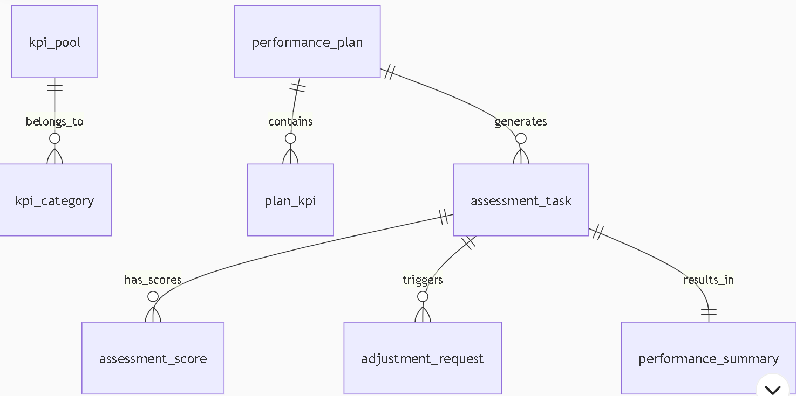

## thinking
用户想要设计一个绩效评定模块的整体方案，他已经整理了一些思路，现在需要我结合市面上的优秀竞品给出完整设计方案。用户的需求非常明确且专业，涉及到绩效评定的全流程设计。
用户已经整理的核心思路包括：KPI录入方式（部分下发和个人指定）、KPI定时审计流程（员工自评、部门打评、汇总评定）、权限控制（员工和领导看到的内容区分）、绩效分类（销售部、技术部等）、KPI池管理、指标评定方式（计算公式和主观评估）、汇总模块流程、绩效调整机制以及生命周期管理。
从搜索结果中，我看到了很多有价值的参考信息。钉钉的Agoal组织绩效模块支持灵活的评定流程配置，绩效评定的完成值录入、自评、环评等环节均可自定义9。环信IM系统的绩效管理功能包括实时数据沉淀、智能分析引擎和全流程协同能力，使绩效管理从传统"年度事件"转变为持续优化的动态过程10。Tita目标绩效一体化产品具有全场景覆盖、配置简单灵活、管理强大、体验轻松、数据分析强大和AI赋能等优势23。
在绩效指标方面，销售部的典型指标包括销售业绩达标、意向客户达标和工作态度等5。技术部可能关注项目进度、质量评分和学习成长等7。北森绩效管理系统采用了"重点工作+民主评议"的方式开展绩效评估6。
关于KPI池管理，Worktile提到系统应提供强大的绩效指标设定和管理功能，包括方便地添加、修改和删除绩效指标，以及为每个指标定义明确的计算方法、权重和评分标准5。
在绩效周期管理上，用户提到了年度、半年度和月度KPI的联动，这与CSDN博客中提到的系统应支持动态调整考核方案的观点一致8。
基于以上分析，我会为用户设计一个完整的绩效评定模块方案，包括功能架构设计（分五个子模块详细说明）、原型与交互设计（三种典型界面）、数据模型设计（七张核心表）以及实施路线图。
在回答时，我会考虑使用表格展示KPI配置参数、评定流程状态机、绩效类别指标配置示例等内容，使设计方案更加清晰。我会在关键设计点处添加emoji图标增强可读性，并使用分隔线区分不同模块。由于内容较为专业和详细，我会确保层次分明，逻辑清晰，便于用户理解和实施

## 整体功能模块设计
1. KPI池管理（全局指标库）
    - 功能设计： 
      - 分类管理：按部门（销售/技术/行政/公共类）建立树状分类体系，支持多级嵌套28。    
      - 指标模板化：每个KPI包含字段：指标名称、计算公式、数据源（系统自动拉取/手动录入）、评定方式（量化公式/主观评分）、权重范围、适用部门58。
      - 版本控制：指标修改后生成新版本，历史考核沿用旧版本，避免数据错乱6。
    - 交互设计：
      - ⚙️ 采用类IDE界面：左侧分类树 + 中部指标列表（含搜索过滤）+ 右侧指标详情编辑器（公式配置器、数据源绑定选项）。

2. 考核周期与任务下发
   - 功能设计：
     智能周期联动：选择年度KPI后，自动拆解为半年度/月度子目标（支持按平均值或自定义比例分配），领导可手动调整9。
   - 多模式下发：
     - 部门统一下发：批量绑定部门公共指标（如销售部的“业绩达成率”）。
     - 个人定制：在部门指标基础上追加个人指标（如技术部的“代码review通过率”）48。

   - 审计节点：设置自评截止日→部门评审日→汇总锁定日，系统自动催办10。
   - 交互设计：
     - 📅 甘特图视图展示考核时间轴，拖拽调整节点；下发时采用“购物车”模式勾选指标并批量配置权重。
## 绩效评定核心流程 
1. 评定阶段分层设计
   阶段	参与角色	操作内容	权限隔离
   员工自评	员工	填写量化数据，上传证明，主观项自述	仅见个人指标，隐藏他人评分
   部门打评	直属领导	修正数据，评分，添加评语	可见团队所有成员数据，隐藏跨部门信息
   汇总评定	HR/绩效委员会	权重校准，争议仲裁，生成最终报告	全局数据可见，操作留痕
2. 动态评分逻辑
   - 量化指标（如销售业绩）：
```python
    # 示例：区间阶梯计算
    def calculate_sales_score(actual, target):
    if actual >= target * 1.2: return 120  # 超额120%
    elif actual >= target: return 100       # 达标
    else: return max(60, actual/target*100) # 保底60分
```

    - 主观指标（如工作态度）：
      - 领导评分时弹出行为锚定案例（如“考勤全勤+日志完整=90分起评”）57。
      - 支持360度环评（同级匿名打分）

3. 数据源处理
   - 自动采集：对接业务系统（如CRM/日志系统），实时同步销售数据、考勤记录。
   - 手动补录：标记为“人工录入”的数据需上传证明附件，审计时重点核查7。
## 绩效调整与历史追溯
1. 变更管理
   场景：指标权重错误、计算公式调整、数据源更正。
流程：
提交变更申请 → 影响范围评估（自动提示关联部门）→ 审批 → 历史版本快照（变更前后对比）
交互：⏱️ 时间线视图展示指标生命周期（创建→调整→归档）。
2. 绩效档案
    功能：
      按员工/部门/时间维度穿透查询历史成绩。
      生成对比报告（如“销售部Q1环比增长分析”）910。
    数据安全：
      员工仅可见本人报告，领导可见团队聚合数据（如部门平均分），HR可导出全量报表6。

## 原型设计与交互关键点

## 微服务名称建议
- 中文名：绩效管理服务
- 英文名：performance-management-service
- 技术模块名：performance-core（核心计算引擎）

1. 角色化工作台
   角色	工作台重点内容
   员工	待自评任务、历史成绩趋势图
   领导	团队绩效雷达图、下属进度催办清单
   HR	全公司考核完成率、异常数据预警
2. 评定界面交互
    员工侧：
      分栏布局：左侧指标说明 + 中部数据填写区 + 右侧实时得分预览。
      公式类指标输入后自动计算得分（如输入销售额→实时显示达成率） 
    领导侧：
      矩阵视图批量评分：支持按员工列表横向对比，避免手松手紧
## 数据模型设计（核心表）
erDiagram
KPI_POOL ||--o{ KPI_CATEGORY : "1:N"
KPI_POOL {
string code PK   "指标编码"
string name
string formula   "计算公式"
string data_source "CRM/Manual/..."
}
PERFORMANCE_PLAN ||--o{ PLAN_KPI : "1:N"
PERFORMANCE_PLAN {
string plan_id PK
date start_date
date end_date
string status    "Draft/Active/Closed"
}
PLAN_KPI {
int weight
string target_value
string kpi_code FK → KPI_POOL
}
ASSESSMENT_TASK ||--o{ ASSESSMENT_SCORE : "1:N"
ASSESSMENT_TASK {
string task_id PK
string employee_id
string plan_id FK → PERFORMANCE_PLAN
}
ASSESSMENT_SCORE {
string kpi_code
number self_score
number manager_score
string proof_attachment
}
ADJUSTMENT_REQUEST {
string request_id PK
string plan_id FK
json old_values  "变更前配置快照"
json new_values
}

表说明：
- KPI_POOL：全局指标库，分离配置与执行数据。
- PLAN_KPI：考核周期内的指标实例（含权重/目标值）。
- ASSESSMENT_SCORE：存储自评/上级评分的版本化记录。
- ADJUSTMENT_REQUEST：审计追踪变更轨迹

## 表结构设计（精简版，满足核心需求）
```sql
-- 1. KPI池管理（全局指标库）
CREATE TABLE `kpi_pool` (
`id` BIGINT AUTO_INCREMENT PRIMARY KEY COMMENT '主键',
`code` VARCHAR(50) UNIQUE NOT NULL COMMENT '指标编码（如SALES_TARGET）',
`name` VARCHAR(100) NOT NULL COMMENT '指标名称',
`formula` TEXT COMMENT '计算公式（Groovy/Python脚本）',
`data_source` ENUM('AUTO','MANUAL') NOT NULL DEFAULT 'MANUAL' COMMENT '数据来源',
`assessment_method` ENUM('QUANTITATIVE','QUALITATIVE') NOT NULL COMMENT '评定方式',
`category_id` BIGINT NOT NULL COMMENT '分类ID',
`weight_range` VARCHAR(20) COMMENT '权重范围（如10-30）',
`version` INT DEFAULT 1 COMMENT '版本号',
`is_active` TINYINT(1) DEFAULT 1 COMMENT '是否启用'
);

-- 2. KPI分类表
CREATE TABLE `kpi_category` (
`id` BIGINT AUTO_INCREMENT PRIMARY KEY,
`name` VARCHAR(50) NOT NULL COMMENT '分类名（销售/技术/公共）',
`parent_id` BIGINT DEFAULT 0 COMMENT '父分类ID',
`level` TINYINT DEFAULT 1 COMMENT '层级'
);

-- 3. 绩效考核计划
CREATE TABLE `performance_plan` (
`id` BIGINT AUTO_INCREMENT PRIMARY KEY,
`name` VARCHAR(100) NOT NULL COMMENT '计划名称（2023Q1销售考核）',
`cycle_type` ENUM('MONTHLY','QUARTERLY','HALF_YEARLY','YEARLY') NOT NULL,
`start_date` DATE NOT NULL,
`end_date` DATE NOT NULL,
`status` ENUM('DRAFT','ACTIVE','CLOSED') DEFAULT 'DRAFT'
);

-- 4. 计划-指标关联表（含智能拆解）
CREATE TABLE `plan_kpi` (
`id` BIGINT AUTO_INCREMENT PRIMARY KEY,
`plan_id` BIGINT NOT NULL COMMENT '关联考核计划',
`kpi_code` VARCHAR(50) NOT NULL COMMENT '关联KPI编码',
`weight` DECIMAL(5,2) NOT NULL COMMENT '权重（0-100）',
`target_value` VARCHAR(100) COMMENT '目标值（动态类型）',
`split_type` ENUM('AVERAGE','CUSTOM') DEFAULT 'AVERAGE' COMMENT '周期拆解方式',
`custom_values` JSON COMMENT '自定义拆解值（{H1:50, H2:60}）'
);

-- 5. 考核任务表（员工维度）
CREATE TABLE `assessment_task` (
`id` BIGINT AUTO_INCREMENT PRIMARY KEY,
`employee_id` BIGINT NOT NULL COMMENT '员工ID',
`plan_id` BIGINT NOT NULL COMMENT '关联考核计划',
`department_id` BIGINT NOT NULL,
`current_stage` ENUM('SELF','MANAGER','HR','COMPLETED') DEFAULT 'SELF' COMMENT '当前阶段',
`self_due_time` DATETIME COMMENT '自评截止时间',
`manager_due_time` DATETIME COMMENT '上级评审截止'
);

-- 6. 考核评分表（支持多版本）
CREATE TABLE `assessment_score` (
`id` BIGINT AUTO_INCREMENT PRIMARY KEY,
`task_id` BIGINT NOT NULL COMMENT '关联考核任务',
`kpi_code` VARCHAR(50) NOT NULL COMMENT 'KPI编码',
`stage` ENUM('SELF','MANAGER','HR') NOT NULL COMMENT '评分阶段',
`value` VARCHAR(100) COMMENT '填写值（如销售额=50000）',
`score` DECIMAL(5,2) COMMENT '计算得分',
`attachment` VARCHAR(200) COMMENT '证明附件路径',
`comments` TEXT COMMENT '评语'
);

-- 7. 绩效调整表
CREATE TABLE `adjustment_request` (
`id` BIGINT AUTO_INCREMENT PRIMARY KEY,
`task_id` BIGINT NOT NULL COMMENT '关联考核任务',
`type` ENUM('KPI','WEIGHT','TARGET') NOT NULL COMMENT '调整类型',
`reason` TEXT NOT NULL COMMENT '调整原因',
`old_data` JSON NOT NULL COMMENT '原数据快照',
`new_data` JSON NOT NULL COMMENT '新数据',
`status` ENUM('PENDING','APPROVED','REJECTED') DEFAULT 'PENDING'
);

-- 8. 绩效汇总表
CREATE TABLE `performance_summary` (
`id` BIGINT AUTO_INCREMENT PRIMARY KEY,
`task_id` BIGINT UNIQUE NOT NULL COMMENT '关联考核任务',
`total_score` DECIMAL(5,2) NOT NULL COMMENT '总分',
`rating` ENUM('A','B','C','D') COMMENT '最终评级',
`report_path` VARCHAR(200) COMMENT '报告存储路径',
`signature` VARCHAR(100) COMMENT '电子签名'
);
```

## 关键表关系说明
erDiagram
kpi_pool ||--o{ kpi_category : belongs_to
performance_plan ||--o{ plan_kpi : contains
performance_plan ||--o{ assessment_task : generates
assessment_task ||--o{ assessment_score : has_scores
assessment_task ||--o{ adjustment_request : triggers
assessment_task ||--|| performance_summary : results_in



## 微服务接口设计（核心功能）

1.  KPI管理服务
```java
// 创建KPI指标
@PostMapping("/kpis")
KpiDTO createKpi(@RequestBody KpiCreateCommand command);

// 按分类查询KPI
@GetMapping("/kpis/category/{categoryId}")
List<KpiDTO> getKpisByCategory(@PathVariable Long categoryId);

```

2. 考核计划服务
```java
// 创建考核计划（含智能拆解）
@PostMapping("/plans")
PerformancePlanDTO createPlan(@RequestBody PlanCreateCommand command);

// 下发部门KPI
@PostMapping("/plans/{planId}/assign-department")
void assignDepartmentKpis(
  @PathVariable Long planId, 
  @RequestBody DepartmentAssignCommand command
);
```
3. 评分引擎服务
```java
// 员工自评提交
@PostMapping("/assessments/self")
void submitSelfAssessment(@RequestBody AssessmentSubmitCommand command);

// 领导批量评分
@PostMapping("/assessments/manager/batch")
void batchManagerScore(@RequestBody List<ManagerScoreCommand> commands);

// 实时得分计算（前端调用）
@GetMapping("/calculators/real-time")
RealTimeScoreDTO calculateRealTimeScore(
  @RequestParam String kpiCode, 
  @RequestParam String inputValue
);
```

4. 调整工作流服务
```java
// 提交调整申请
@PostMapping("/adjustments")
AdjustmentDTO requestAdjustment(@RequestBody AdjustmentRequestCommand command);

// 审批调整
@PutMapping("/adjustments/{id}/approve")
void approveAdjustment(@PathVariable Long id, @RequestBody ApprovalCommand command);
```

## 表设计特点
1. 动态公式支持
kpi_pool.formula 字段存储可执行脚本，支持动态计算（如阶梯提成算法）

2. 智能周期拆解
plan_kpi.split_type 实现年度KPI自动拆解为半年度/月度目标

3. 审计追踪
adjustment_request.old_data/new_data 以JSON存储完整变更快照

4. 权限隔离设计
员工只能看到自己的 assessment_task
领导通过 department_id 过滤团队数据
HR可访问全量数据
5. 多阶段评分
assessment_score.stage 区分自评/上级评/HR评版本

## 性能优化建议
1. 评分计算

```sql
-- 添加复合索引加速评分查询
CREATE INDEX idx_task_kpi ON assessment_score (task_id, kpi_code);
```

2. 汇总表预计算

```java
// 使用定时任务预生成汇总数据
@Scheduled(cron = "0 0 2 * * *") // 每天凌晨2点执行
void precalculateSummaries() {
// 批量计算已完成任务的绩效总分
}
```
3. 历史数据归档
对 assessment_score 按 plan.end_date 分区存储，冷热数据分离
此设计满足：
. 百万级员工考核场景
. 毫秒级实时得分计算
. 完整的审计追踪链条
    可作为 performance-management-service 微服务的核心数据模型
## 功能模块和菜单设计

绩效管理模块功能菜单
1. 全局指标库管理（HR管理员专用）
   指标分类管理

添加部门分类（销售/技术/行政/公共）

设置分类层级关系

分类权重分配

KPI池维护

新建标准指标（名称/编码/公式）

指标批量导入/导出

指标版本对比（历史记录）

数据源配置

对接业务系统（CRM/考勤/日志）

设置自动采集规则

人工录入字段配置

2. 考核周期管理
   考核计划创建

设置周期类型（月度/季度/年度）

时间轴配置（自评/部门评/终审节点）

智能拆解设置（自动拆分年度目标）

考核任务下发

部门统一下发（批量绑定公共指标）

个人定制指标（追加专属KPI）

员工确认通知（消息中心联动）

计划监控看板

部门完成率热力图

逾期任务预警列表

进度实时追踪（甘特图）

3. 绩效评定中心
   员工自评工作台

待办任务清单

指标卡片式填写（含实时得分计算）

证明附件上传（图片/文档）

历史成绩对比视图

领导评分工作台

团队矩阵视图（横向对比）

批量评分模式（Excel式操作）

锚定案例参考库（评分标准）

异常数据提示（偏离均值预警）

HR终审工作台

争议仲裁处理

权重校准工具

强制分布配置（A/B/C/D比例）

4. 绩效调整管理
   变更申请

指标权重调整

计算公式修正

数据源变更请求

影响分析

变更波及范围预测

前后效果模拟对比

审批工作流

多级审批链配置

电子签名确认

变更历史追溯

5. 绩效档案中心
   个人档案

历史成绩趋势图

能力雷达图（指标维度）

报告下载（PDF/Excel）

团队档案

部门排名榜单

人才九宫格矩阵

离职风险预测

公司级分析

绩效分布热力图

高绩效员工特征分析

薪酬绩效关联模型

6. 系统配置（管理员专用）
   角色权限管理

员工：仅查看个人数据

领导：团队数据+评分权

HR：全局管理+报表导出

公式引擎配置

拖拽式公式构建器

脚本调试控制台

函数库管理（预置20+计算函数）

通知模板管理

任务到期提醒

评分冲突通知

报告生成推送

菜单权限对照表
功能模块	员工	部门主管	HR管理员
全局指标库管理	❌	❌	✅
考核周期创建	❌	✅	✅
员工自评工作台	✅	❌	❌
领导评分工作台	❌	✅	✅
绩效调整申请	✅	✅	✅
团队档案分析	❌	✅	✅
公式引擎配置	❌	❌	✅
