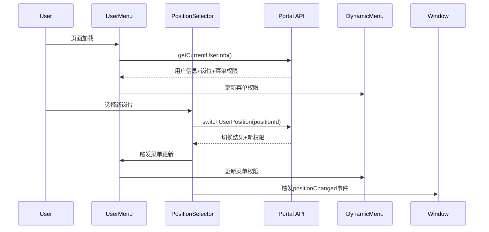

# Portal用户系统岗位切换功能实现

## 功能概述

根据高保真原型页面和Portal用户系统功能实现总结，我们完成了右上角岗位列表和切换功能的实现，包含了完整的权限系统和动态菜单更新功能。

## 已实现的核心功能

### 1. 岗位选择器组件 (PositionSelector)
- **文件位置**: `src/components/PositionSelector/index.tsx`
- **功能特性**:
  - 动态加载用户的所有岗位
  - 支持岗位切换操作
  - 显示岗位名称和所属部门
  - 切换成功后显示消息提示
  - 触发全局岗位切换事件

### 2. 用户菜单组件 (UserMenu)
- **文件位置**: `src/components/UserMenu/index.tsx`
- **功能特性**:
  - 集成岗位选择器
  - 显示用户头像和基本信息
  - 用户下拉菜单（个人资料、设置、退出登录）
  - 自动加载用户信息和权限菜单
  - 处理岗位切换和菜单更新

### 3. 动态菜单组件 (DynamicMenu)
- **文件位置**: `src/components/DynamicMenu/index.tsx`
- **功能特性**:
  - 根据用户权限动态生成菜单
  - 支持多级菜单结构
  - 图标映射和菜单样式
  - 自动选中当前页面菜单项
  - 支持菜单权限过滤

### 4. Portal API服务
- **文件位置**: `src/services/portal.ts`
- **包含接口**:
  - `getCurrentUserInfo()` - 获取当前用户完整信息
  - `getUserPositions()` - 获取用户岗位列表
  - `switchUserPosition(positionId)` - 切换用户岗位
  - `getCurrentUserMenus()` - 获取用户菜单权限
  - `getPositionMenus(positionId)` - 获取指定岗位的菜单权限

## 技术架构

### 组件层次结构
```
BasicLayout
├── DynamicMenu (左侧导航菜单)
└── UserMenu (右上角用户菜单)
    └── PositionSelector (岗位选择器)
```

### 数据流
1. 用户登录后，`UserMenu`组件自动加载用户信息
2. 获取用户的所有岗位和当前岗位的菜单权限
3. 将菜单权限传递给`BasicLayout`，更新左侧导航菜单
4. 用户切换岗位时，重新获取菜单权限并更新界面
5. 触发全局`positionChanged`事件，通知其他组件

### API调用流程


## 使用方法

### 1. 基本使用
在`BasicLayout`中已经集成了新的组件：

```tsx
import UserMenu from '../components/UserMenu';
import DynamicMenu from '../components/DynamicMenu';

// 在布局组件中使用
<UserMenu onMenuUpdate={handleMenuUpdate} />
<DynamicMenu menus={menus} theme="light" mode="inline" />
```

### 2. 监听岗位切换事件
在需要响应岗位切换的组件中：

```tsx
useEffect(() => {
  const handlePositionChange = (event: any) => {
    const position = event.detail?.position;
    console.log('岗位切换:', position);
    // 处理岗位切换逻辑
  };

  window.addEventListener('positionChanged', handlePositionChange);
  return () => {
    window.removeEventListener('positionChanged', handlePositionChange);
  };
}, []);
```

## 样式设计

### 响应式布局
- 桌面端：完整显示岗位信息和用户详情
- 移动端：紧凑显示，隐藏次要信息
- 支持主题切换（浅色/深色）

### 视觉效果
- 岗位选择器采用下拉选择框样式
- 用户头像支持自定义图片或默认字母头像
- 菜单权限更新有流畅的过渡动画
- 成功提示使用Antd的message组件

## 后端API对接

### 请求格式
所有API请求都使用标准的REST风格，基础路径为`/api-portal`：

```bash
# 获取用户信息
GET /api-portal/users/current

# 切换岗位
POST /api-portal/users/switch-position?positionId=123

# 获取菜单权限
GET /api-portal/users/menus
```

### 响应格式
```json
{
  "success": true,
  "data": {
    "user": {...},
    "employee": {...},
    "positions": [...],
    "currentPosition": {...},
    "menus": [...],
    "personalConfig": {...}
  },
  "message": "操作成功"
}
```

## 测试功能

### 示例页面
- 更新了`Dashboard`页面来展示岗位切换功能
- 实时显示当前岗位和切换时间
- 提供功能使用说明

### 测试步骤
1. 启动前端项目：`npm start`
2. 登录系统后查看右上角岗位选择器
3. 点击下拉菜单选择不同岗位
4. 观察左侧菜单的权限变化
5. 在Dashboard页面查看岗位切换效果

## 扩展功能

### 已支持的扩展点
1. **图标映射扩展**: 在`DynamicMenu`中添加新的图标映射
2. **权限粒度控制**: 支持按钮级别的权限控制
3. **个性化配置**: 支持用户个性化设置
4. **多租户支持**: 完整的多租户数据隔离

### 未来改进方向
1. 权限缓存优化（Redis）
2. 权限变更实时推送
3. 更丰富的个性化配置选项
4. 移动端优化改进

## 注意事项

1. **权限数据格式**: 确保后端返回的菜单权限数据符合`MenuPermission`接口定义
2. **错误处理**: 所有API调用都包含了完整的错误处理机制
3. **性能优化**: 使用了`useMemo`和`useEffect`进行性能优化
4. **TypeScript支持**: 所有组件都有完整的类型定义

## 文件清单

### 新增文件
- `src/services/portal.ts` - Portal API服务
- `src/components/PositionSelector/index.tsx` - 岗位选择器组件
- `src/components/PositionSelector/index.less` - 岗位选择器样式
- `src/components/UserMenu/index.tsx` - 用户菜单组件
- `src/components/UserMenu/index.less` - 用户菜单样式
- `src/components/DynamicMenu/index.tsx` - 动态菜单组件

### 修改文件
- `src/layouts/BasicLayout.tsx` - 集成新组件
- `src/layouts/BasicLayout.less` - 更新样式
- `src/pages/Dashboard/index.tsx` - 示例页面更新

这个实现完全基于Portal用户系统功能实现总结的设计，支持企业级的权限管理和岗位切换功能。 